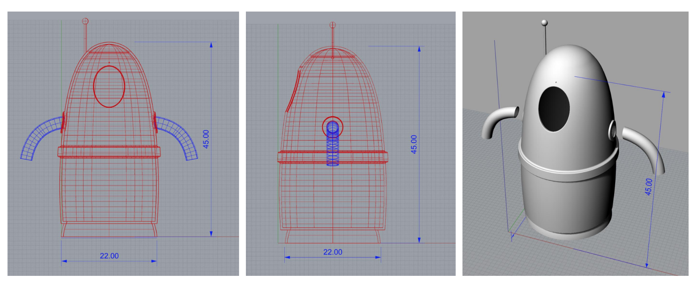
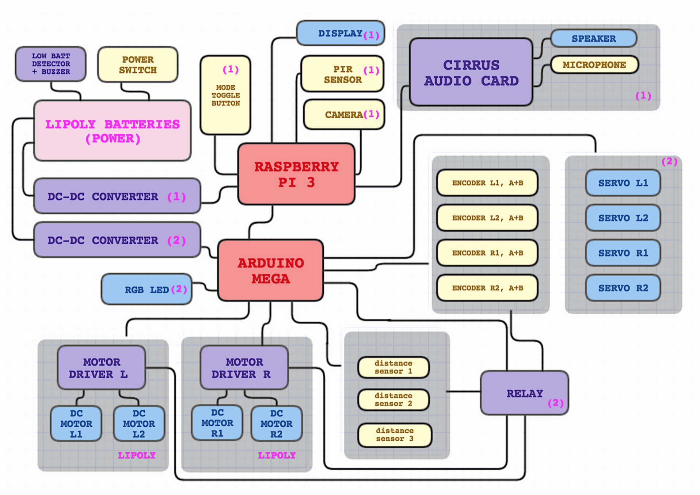
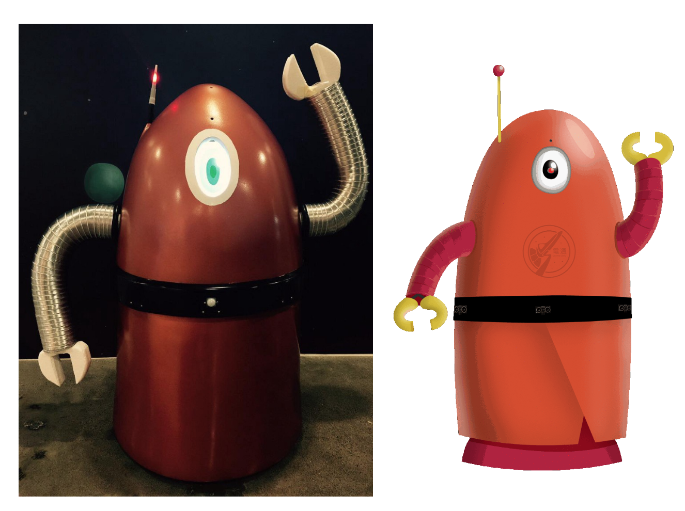
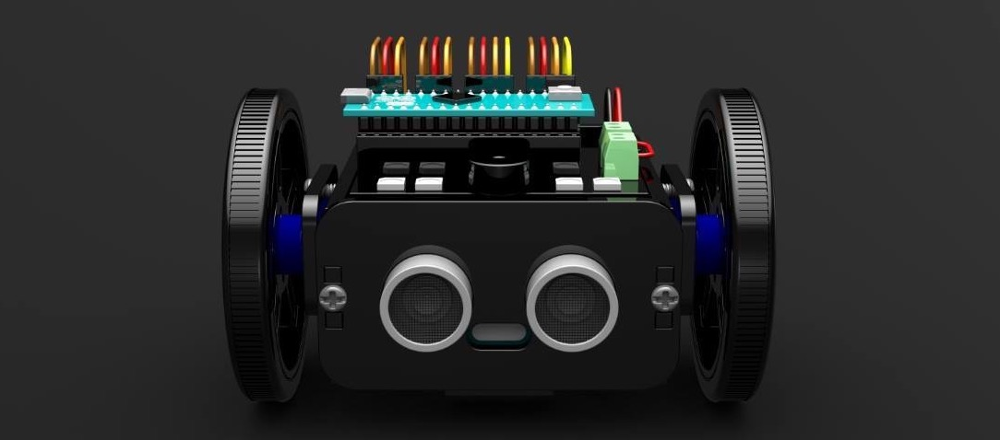
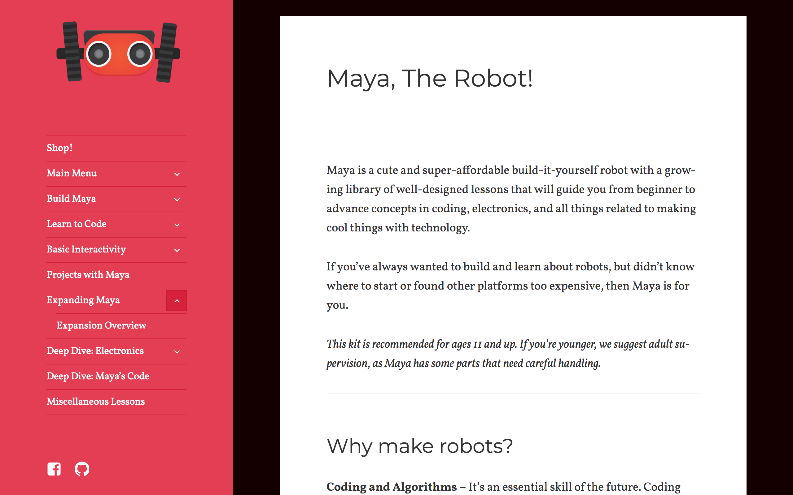
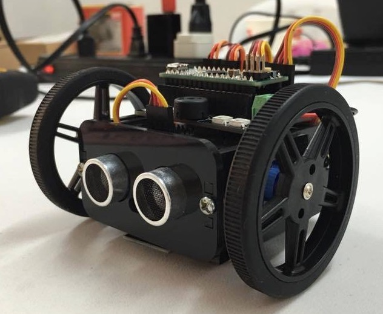
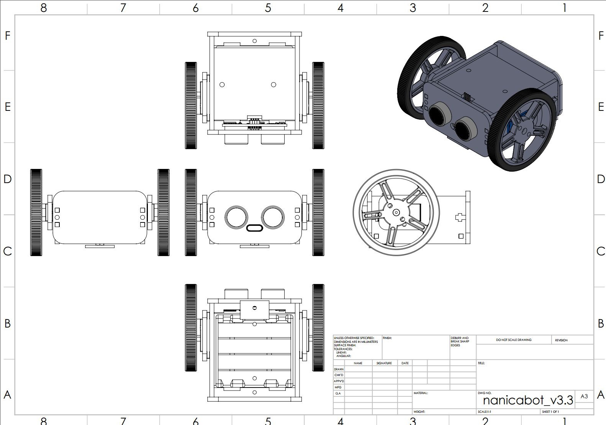
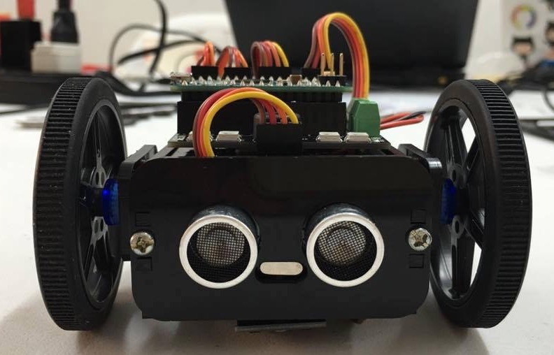
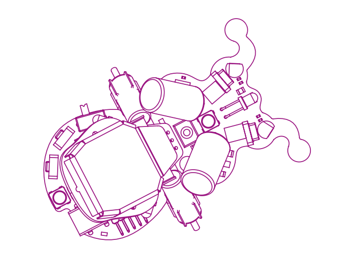
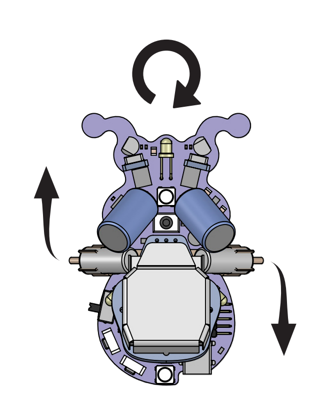

# 2015 - 2016 ROBOTICS PROJECTS

# STUBBY
- Scripts for visual artist Daniel Slattnes. The movements done by the hexapod robot is supposedly based on the signals from the mounted plant's leaves.
- :tv:[Video 1](https://www.youtube.com/watch?v=9wri8Cr78Lo&feature=youtu.be)
- :tv:[Video 2](https://www.youtube.com/watch?v=Dt8aBi2poVQ&feature=youtu.be)

| |  | 
--- | --- | 

# HELLOBOT

- [MEDIUM ARTICLE](https://medium.freecodecamp.org/building-a-voice-activated-robot-for-an-advertising-agency-fedaa9f347d3
)
- :tv:[VIDEO 1](https://www.youtube.com/watch?v=Vm52cbjBIXY)
- :tv:[VIDEO 2](https://www.youtube.com/watch?v=AUFK5NduJuw)
- :tv:[VIDEO 3](https://www.youtube.com/watch?v=ZVj9yphvHjk)

|       |       |
| ----------------------------- |:-------------------------------:|
|       |         |

# MAYA

- Library for the now canceled robot project
- [MAYA TUTORIALS](https://robotmaya.wordpress.com/)
- [NANICA YOUTUBE](https://www.youtube.com/channel/UC0JFv2LIAz9EBLvpGctVzCg)
- [NANICA FB](https://www.facebook.com/nanicalabs/)

|       |       |
| ----------------------------- |:-------------------------------:|
|       |         |

# RINGO
- Alternative OOP style Library for Plumgeek's Ringo Robot
- [PLUMGEEK](http://www.plumgeek.com/)

 |  | 
--- | --- | ---
||
