# 2015 - 2016 ROBOTICS PROJECTS
- Stubby
- Hellobot
- Maya
- Ringo

# Other Related Projects 
- [Creative Technology Prototypes](./creative-tech-prototypes-old-maker-toys)
- [Dancing Hexapod](https://github.com/mithi/hexy)
- [Some Udacity Projects](https://github.com/mithi/some-udacity-projects)
- [Arduino BootCamp](https://github.com/mithi/arduino-basic)

# STUBBY and Quadrupdeds
- Scripts for visual artist Daniel Slattnes. The movements done by the hexapod and quadruped robots is  based on the signals from the mounted plant's leaves.
- :tv:[Video 1](https://www.youtube.com/watch?v=9wri8Cr78Lo&feature=youtu.be)
- :tv:[Video 2](https://www.youtube.com/watch?v=Dt8aBi2poVQ&feature=youtu.be)
- [(Quadrupeds) Plant Cyborgs Page](https://staging-my-site-ef3c79fe.ploy.build/plant-cyborgs)
- [(Quadrupeds) Plant Cyborgs @ Meta.Morf X - Digital Wild March 2020](https://www.youtube.com/watch?v=JkQW0T6Gr3I)

**Quadruped Robot Scripts**
- [Calibrating Script](https://gist.github.com/mithi/92113b9633eb9edb6818d0a501a53f9d)
- [Basic Tests](https://gist.github.com/mithi/eff91e9412cbb169f4d5692b462712b9)
- [Basic Walk Test](https://gist.github.com/mithi/872ab2373fb18149cf4742845a270fa0)
- [Stubby Modification](https://gist.github.com/mithi/c13616713f3c93c353b61a5991625ec2)

|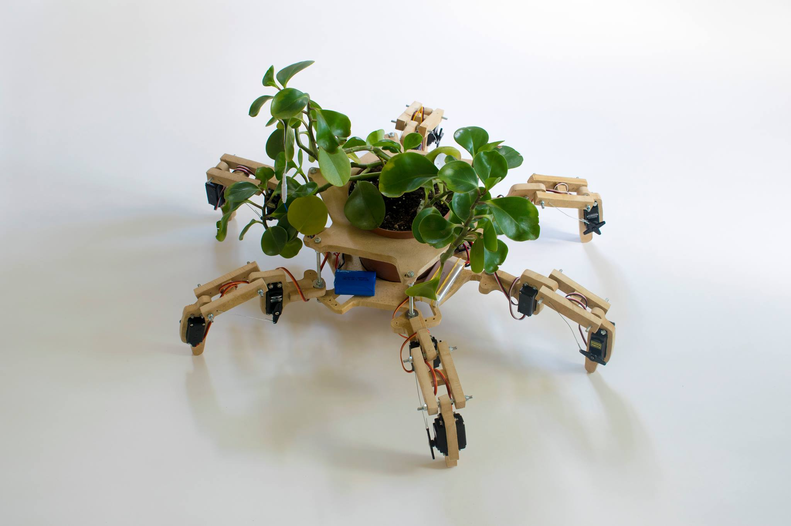 |  | 
--- | --- | 

# HELLOBOT

- [MEDIUM ARTICLE](https://medium.freecodecamp.org/building-a-voice-activated-robot-for-an-advertising-agency-fedaa9f347d3
)
- :tv:[VIDEO 1](https://www.youtube.com/watch?v=Vm52cbjBIXY)
- :tv:[VIDEO 2](https://www.youtube.com/watch?v=AUFK5NduJuw)
- :tv:[VIDEO 3](https://www.youtube.com/watch?v=ZVj9yphvHjk)

|       | 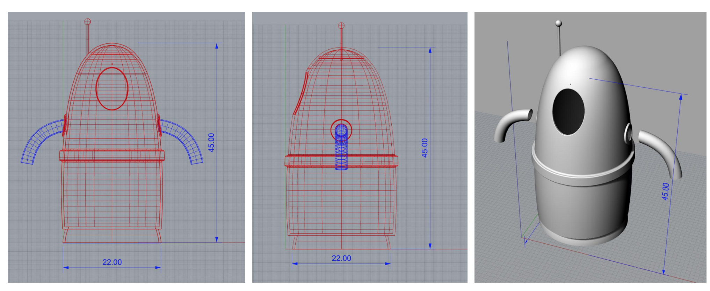      |
| ----------------------------- |:-------------------------------:|
| 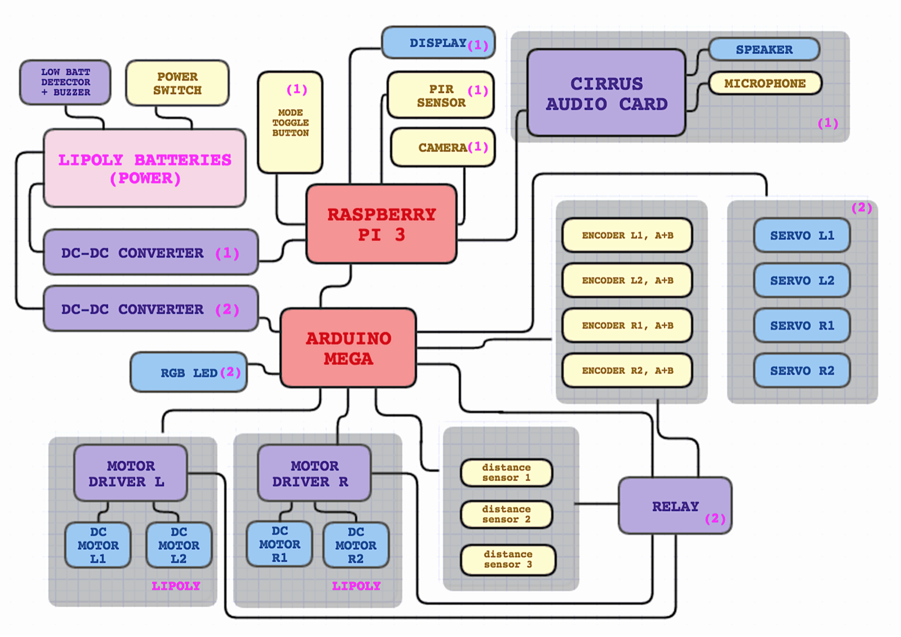      | 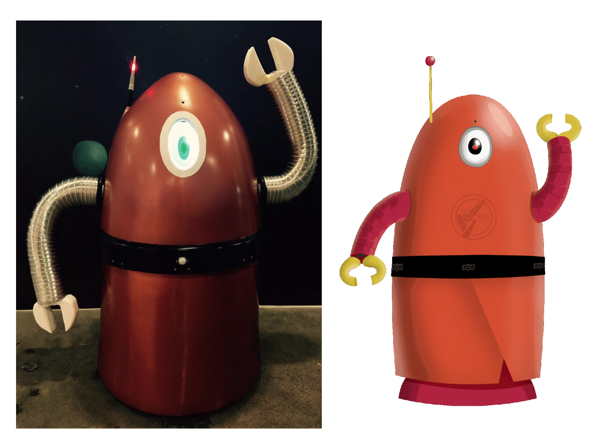        |

# MAYA
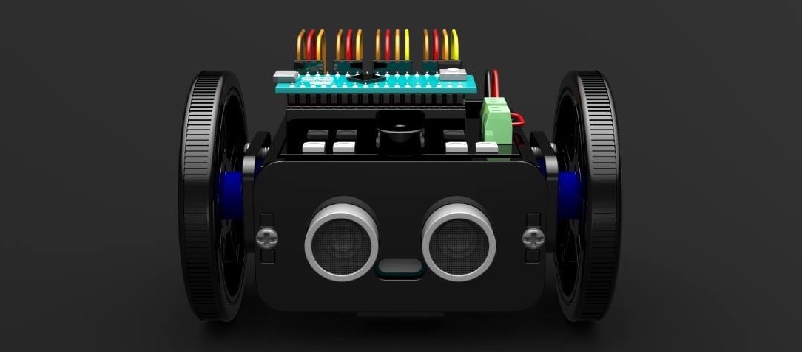

- Library for the now canceled robot project
- [MAYA TUTORIALS](https://robotmaya.wordpress.com/)
- [NANICA YOUTUBE](https://www.youtube.com/channel/UC0JFv2LIAz9EBLvpGctVzCg)
- [NANICA FB](https://www.facebook.com/nanicalabs/)

| 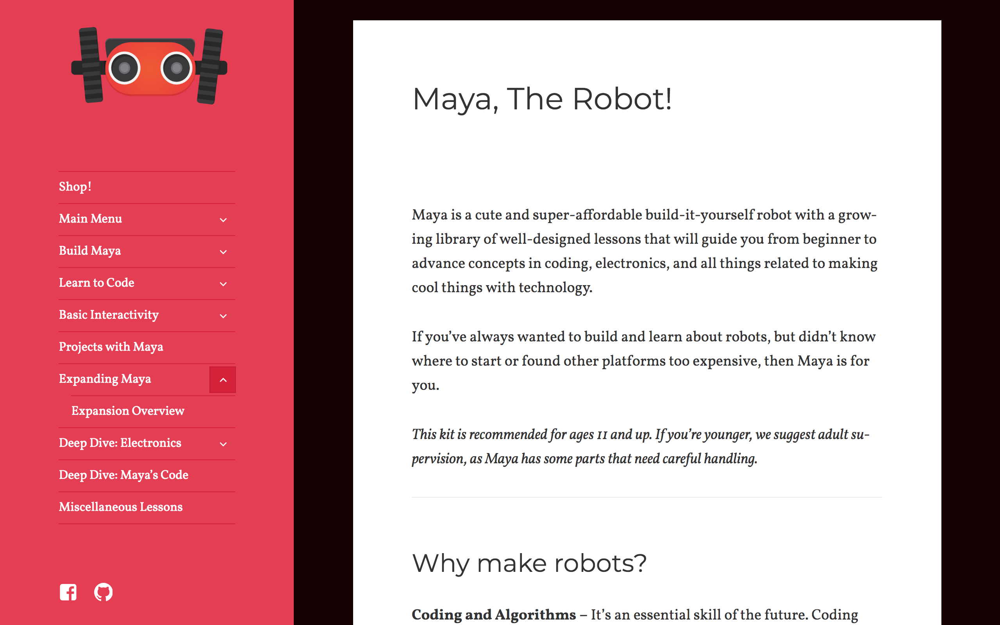      | 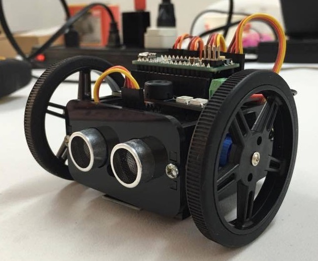      |
| ----------------------------- |:-------------------------------:|
| 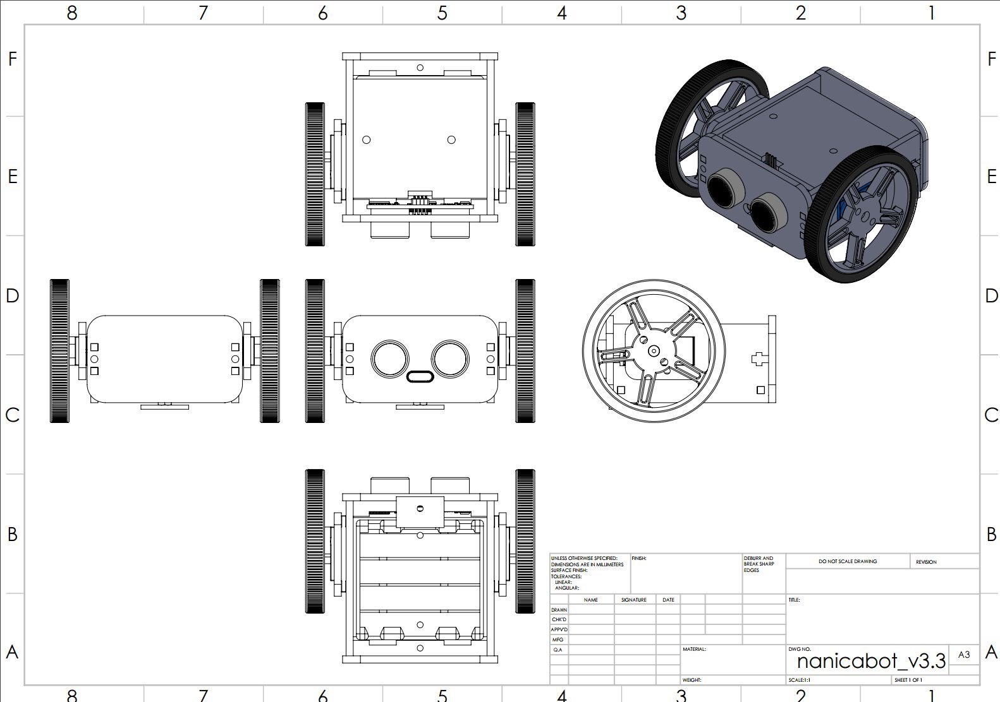      | 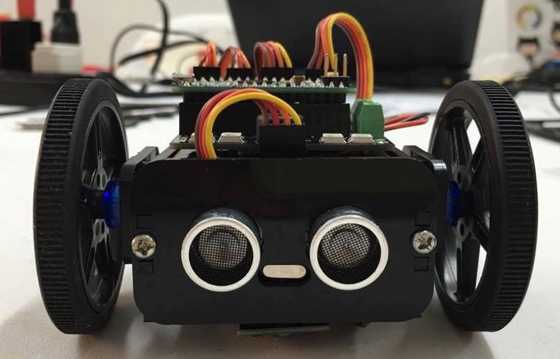        |

# RINGO
- Alternative OOP style Library for Plumgeek's Ringo Robot
- [PLUMGEEK](https://www.kickstarter.com/projects/plumgeek/ringo-the-palm-size-robot-with-real-personality/creator)

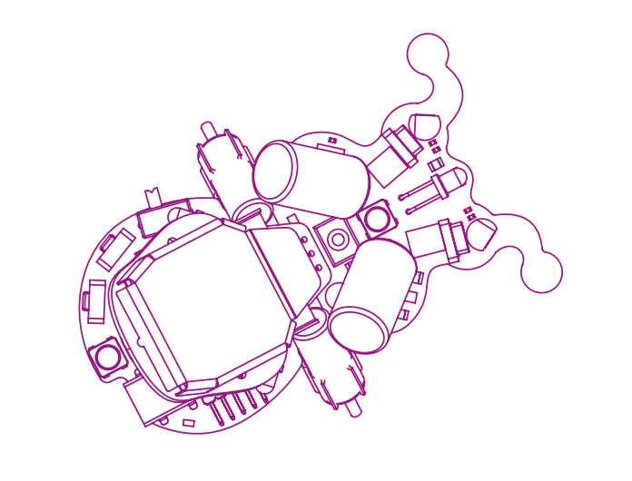 | 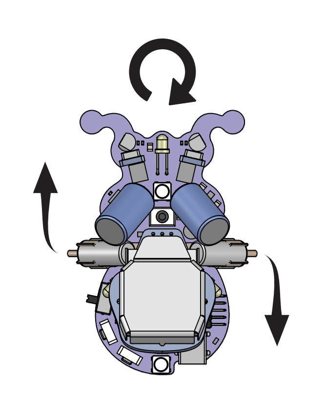 | 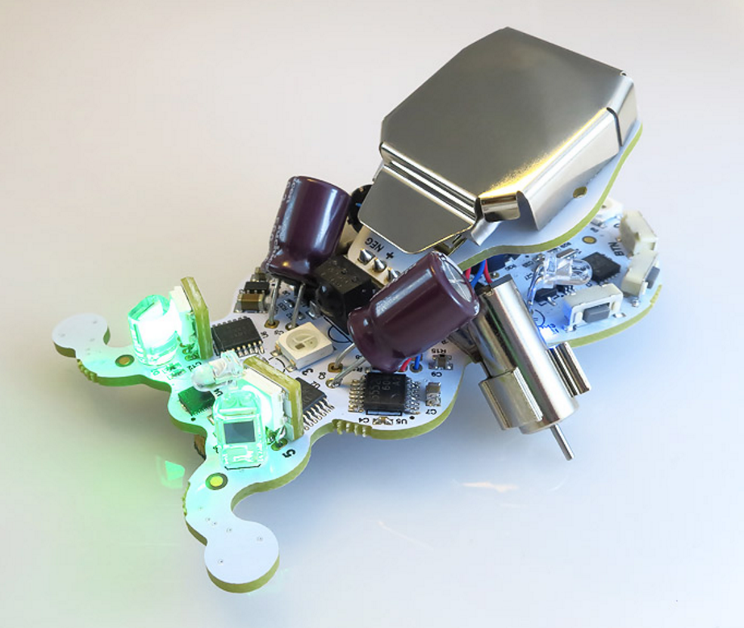
--- | --- | ---
||
