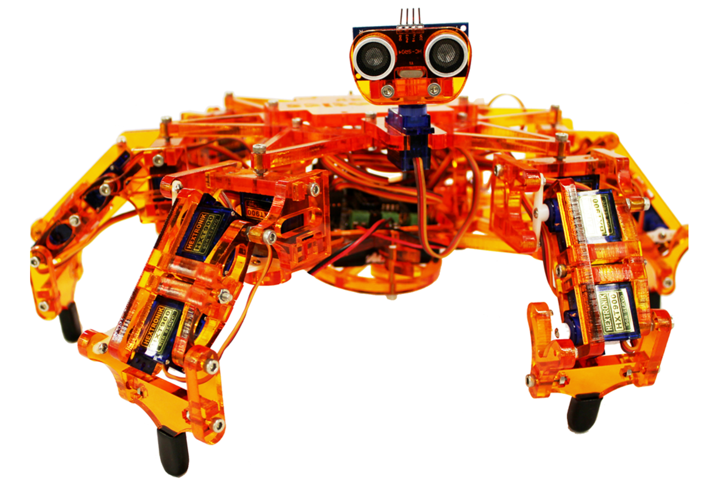
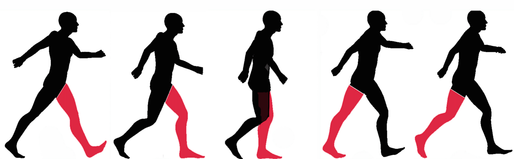
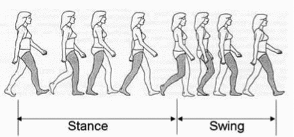
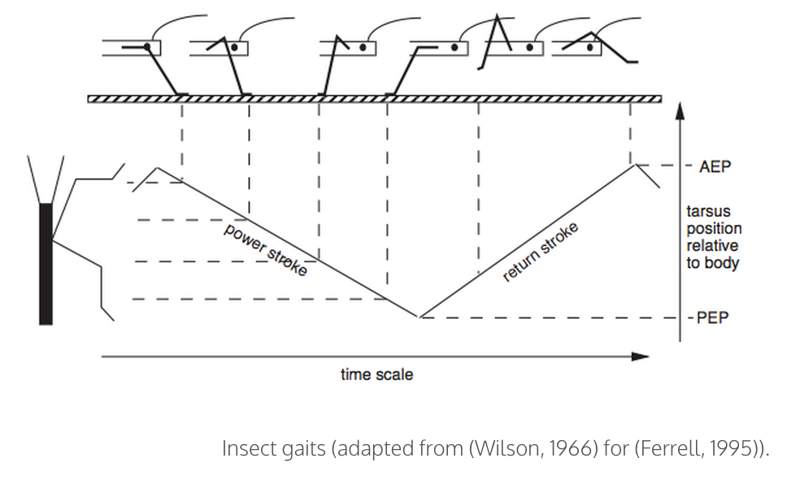
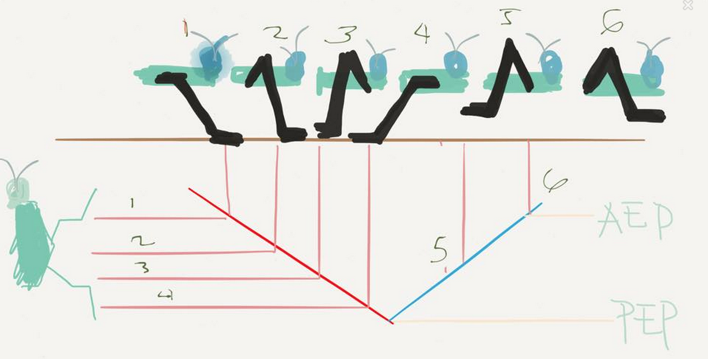
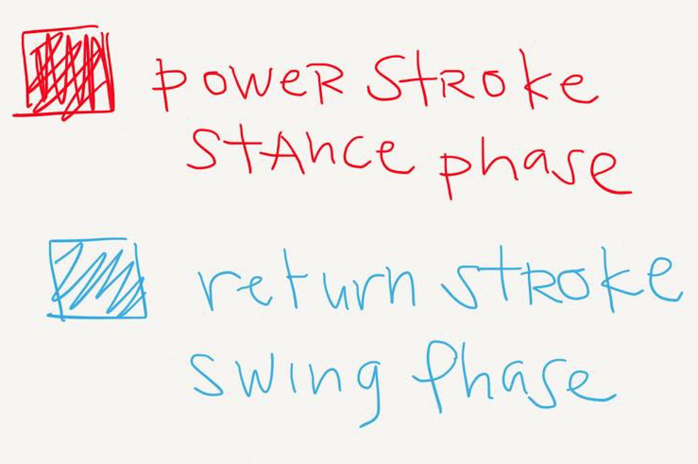
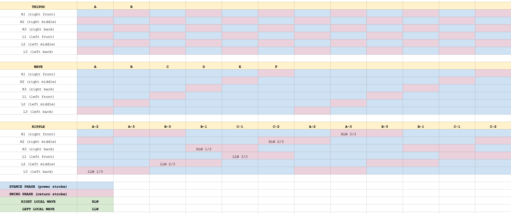
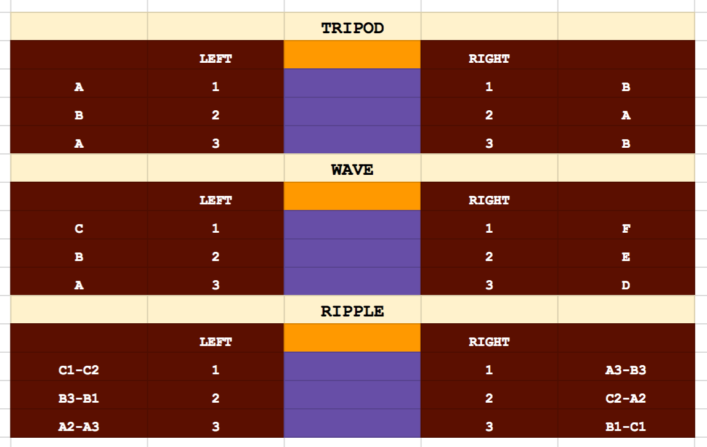
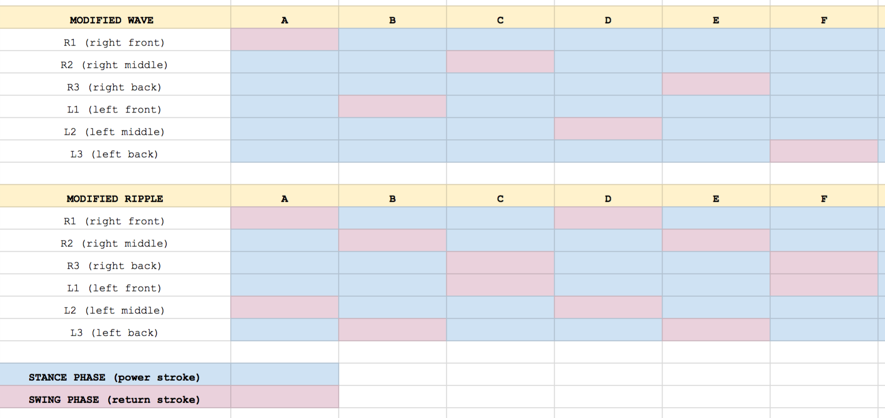

There are countless ways for bi-pedal creatures, such as human beings, to move from point A to point B. You can walk, run, jog, hop, skip, gallop, twirl, or dance your way from the start to the finish line to name a few. And that’s just with two legs! What more for six-legged hexapods!

Even with the myriad ways a human can travel, we usually stick to just walking or running — one foot after the other. Walking and running are the common **_gaits_** for human beings. A gait, by definition, is a pattern of movement of the limbs during locomotion over a solid substrate. To put it simply, gait is how an animal or a robot moves its joints to travel in a land-like surface (as opposed to water or air). Just as with humans, insects with six feet also have common gaits. We will talk about this in this article.

We will discuss some terms which we will use to describe gaits. We will then use these terms to describe the three most common gaits seen in six-legged insects: the **_tripod_**, the **_ripple_**, and the **_wave_** .

* * *

### Limb Movement Cycle

To understand gaits, let us first look at the movement of one limb. We can partition the movement of one limb into two phases: the**_stance phase_** and the **_swing phase_**. The stance phase is when the foot is in contact with the ground. The swing phase is when the foot is lifted from the ground. A cycle of limb movement is composed to a stance phase followed by a swing phase. Each limb should complete a cycle in the same period. If the limbs relationship with each other changes over time and a steady pattern cannot occur.

from [http://insectsandrobots.weebly.com/tripod-gait.html](http://insectsandrobots.weebly.com/tripod-gait.html)

In the stance phase, the leg is on the ground where it supports and propels the body. When walking forward during this phase, the leg **_retracts_** or moves towards the rear of the body. This is also sometimes called the **_support phase_** or the **_power stroke_**.

In the swing phase, the leg lifts and swings to the starting position of the next stance phase. When walking forward during this phase, the leg **_protracts_** or moves towards the front of the body. This is also sometimes called the **_recovery phase_** or the **_return stroke_**.

When walking forward, the target position of the swing phase is called the**_Anterior Extreme Position (AEP)._** When walking forward, the target position of the stance phase is called the **_Posterior Extreme Position (PEP)._**

* * *

### Common walking gaits

#### THE TRIPOD GAIT

A tripod consists of the front-back leg of one side and the middle leg of the opposite site. The walking mechanism consists of one set of legs (a tripod) is on the stance phase while the other set is on the swing phase. In other words, Each tripod takes turns for each phase. Three legs remain on the ground while the other three legs swing forward and then they alternate much like how a biped walks. The tripod gait is fastest common gait if the step size is held constant.

#### THE WAVE GAIT

In the wave gait, each leg move forward one at a time (swing phase) while the other five provide support (stance phase). It starts at the rear most leg of one side followed by the middle leg and then the front leg of the same side. This is then repeated on the opposite side. The wave gait is the most stable common gait as it keeps the most legs on the ground. It is also most likely the easiest to adjust in an uneven terrain. The wave gait is the slowest as only one leg is off the ground at a time.

#### THE RIPPLE GAIT

If you look at the graph above, this gait looks complicated. But you could recognize that each side is a local wave consisting of non-overlapping swing phases. The opposite side is also a local wave that is exactly out of phase with it. If we consider the left rear leg (L3) and the right rear leg (R3) are the start of each local wave, notice that the right local wave (R3-R2-R1) starts exactly at the middle of the left local wave (L3-L2-L1) — more specifically, in the middle of the swing phase of the middle left leg (L2). The ripple gait is a balance of speed and stability.

In this article, I introduced the concept of gaits and various terms used in describing the movement on one leg. We then used these terms to describe the three most common gaits found in six-legged insects. Of course, we need not be limited to the gaits we see in commonly see in nature. Sure we can make our own gaits like the ones in the graph above (I just invented them on the fly haha). But first, try to make Hexy walk using these common gaits! In the next session, we will be using the tripod gait to make Hexy move forward and backward. We will also be programming Hexy to \[a\] turn (left/right) and \[b\] side-step (left/right), one tripod at a time.

* * *

#### REFERENCES

\[1\] Analysis of Multi-Legged Animal + Robot Gaits[http://www.oricomtech.com/projects/leg-time.htm](http://www.oricomtech.com/projects/leg-time.htm)

\[2\] A Comparison of Three Insect Inspired Locomotion Controllers[http://web.media.mit.edu/~cynthiab/Papers/Breazeal-RAS95.pdf](http://web.media.mit.edu/~cynthiab/Papers/Breazeal-RAS95.pdf)

\[3\] [http://insectsandrobots.weebly.com/tripod-gait.html](http://insectsandrobots.weebly.com/tripod-gait.html) (adapted from (Wilson, 1966) for (Ferrell, 1995)).
