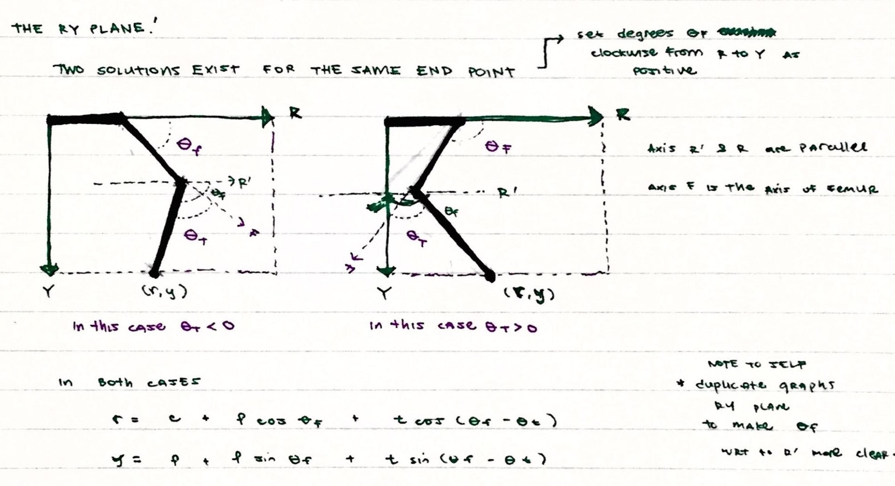

### The Mathematics Behind The Legs

We will be discussing a few things about the forward kinematics and inverse kinematics of Hexy’s legs. Forward kinematics is how you find the orientations of the legs if you know the angle each joint makes. Inverse kinematics is the opposite.

* * *

### Direct Kinematics

Let’s start with a very basic question, given that I know the three joint angles of one of Hexy’s legs, what is the location of the tip of Hexy’s foot?


To answer this vague question, we must first we measure the length of each link `**_( link 1 — hip — coxia, link 2 — thigh — femur, link 3 — foot- tibia)_**`. For simplicity, we model Hexy’s legs as a series of two dimensional links in 3d space.We assign a coordinate system with an origin to locate the tip of Hexy’s foot with respect to that origin. Again, for simplicity, the origin chosen would be the farthest side from the tip of the the foot (the side of the hip connected to the Hexy’s body) as this seems to be a point that we generally know.


* * *

### WHAT WE KNOW

**_Fixed Constants_**

```
f — length of the thigh
```

```
c — length of the hip
```

```
t — length of the foot
```

**_Independent Variables_**

`**Oc**  — angle between the x-axis and the plane of the leg (RY Plane)`

`**Of** ` `— angle between the R-axis (as defined by the direction of the _hip/Coxia_link) and the _thigh/Femur_ link`

`**Ot** ` `— angle between the axis defined by the direction of the _thigh/Femur_ link and the _foot/Tibia_ link`

* * *

 

**So far— we know six things (three fixed constants and three independent variables) `f, c, t, Oc, Of, Ot`. We want to know `(x,y,z)`.**

Nothing a little trigonometry and geometry can’t handle!

 

* * *

 

Let’s solve for a two dimensional case first **`(r, y)` with respect to the RY plane** before expanding to 3D. Note that two solutions exist for the same end points as illustrated below. But note that we don’t really care for the 2nd solution because of stability reasons.

```
r = c + f cos (Of) + t * cos (Of — Ot)
```

```
y = f * sin(Of) + t * sin(Of — Ot)
```



* * *

 

**We can break `‘r’` down into its `‘x’` and `‘z’` components.**

 

* * *

 


* * *

```
x = r* cos(Oc)
```

```
z = r*sin(Oc)
```

```
where r is the projection of the leg’s tip to the R-axis.
```

```
r = c + f * cos (Of) + t * cos(Of — Ot)
```

* * *

That wasn’t so bad wasn’t it? :)

* * *

### Inverse Kinematics

**To determine which angles to direct Hexy’s joints, given that we know where to place Hexy’s foot tip coordinates `(x, y, z)` is a little bit more involved.**

* * *

 

Oc is fairly trivial, it’s just:

`**Oc = inverseTangent( Z/X)**`

* * *

For **`Of`** and **`Ot`**, it’s more complicated, we need to use the cosine law.


* * *

With a little bit of trigonometry and geometry, we’ll break Hexy’s foot down into manageable pieces. Given that we know **`Of`**, **`r`**, **`c`**, **`y`**. We used additional variables **`alpha`**, **`beta`**, **`d`**, and **`L`** to make our lives easier. Take a look at the figure below.


* * *

```

d = r — c
```

```
L*L = r*r + d*d (from pythagorean theorem)
```

```
beta = inverseTangent (d/y)
```

```
90 degrees = Of + alpha + beta


```

* * *

To get **`alpha`**, let’s use the cosine law,

`**t*t = f*f + L*L = 2*f*L cos (alpha)**`

or with a little bit of algebra:

`**alpha = inverseCosine ([f*f + L*L — t*t]/[2*f*L])**`

Now that we know alpha and beta, and we know that **`alpha`**, **`beta`** and **`Of`** make up 90 degrees, we can solve for **`Of`**!

* * *


* * *

**The same procedure is used to get `Ot`!**

```
180 degrees = gamma + Ot
```

```
gamma = inverseCosine( [f*f + t*t — L*L] / [2*f*t] )


```

* * *


