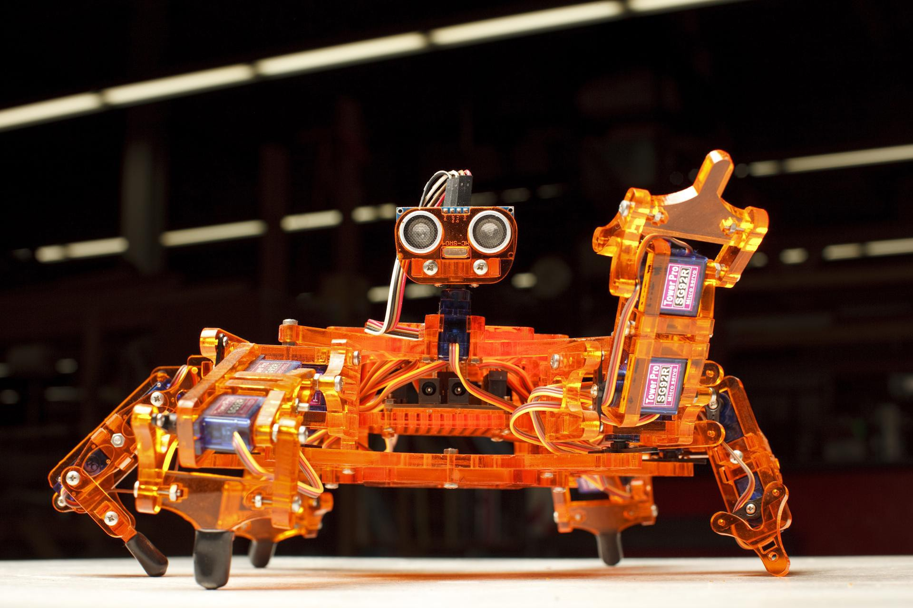
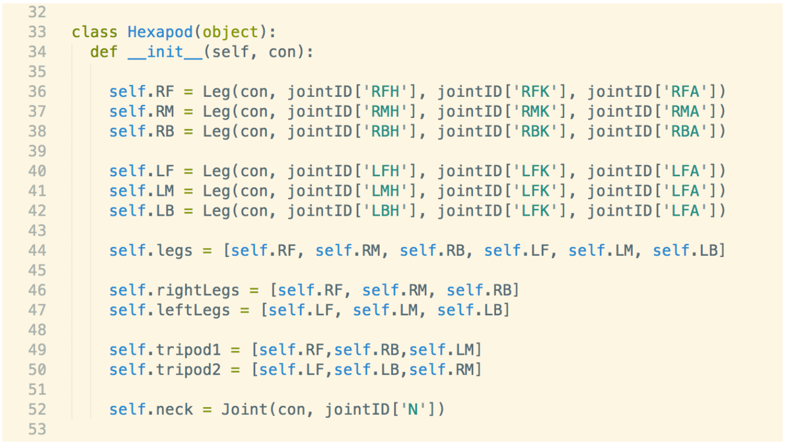

### Introduction to Hexapods

- Advantages and disadvantages of hexapod robots
- Brief overview of what we will be tackling in this workshop

**A hexapod robot is a robot with six legs. Hexapods can be used in applications with uneven, unpredictable terrain from stair-climbing inside a house to search-and-rescue operations in hazardous disaster zones.**

#####  

**Here are a few awesome advantages of hexapod robots over wheeled, octopedal, quadrupedal and bipedal robots:**

1. Wheeled robots are faster on flat surfaces compared to legged robots. However, they are horrible on uneven terrain in which legged robots excel. Some studies have shown that having legs larger than six does not increase walking speed, making hexapods arguably the fastest among legged robots\[1\] .
2. Legged robots like hexapods can traverse uneven ground, step over obstacles and can choose footholds to maximize stability and traction unlike wheeled robots that need even flat surfaces.
3. A hexapod can still travel by changing its walking mechanism even if some of its legs malfunction or gets damaged.
4. Hexapods can also use one or more of its legs as hands to perform dexterous tasks while maintaining stability even when travelling.
5. A Hexapod is very stable because there can be up to five legs in contact with the ground when traveling. Even in tripod gait walking in which three legs move at a time, the center of gravity of a hexapod consistently stays within the tripod.
6. Compared to wheeled or tracked robots, legged robots like hexapods have less environmental effects because their leg tips have very low surface area that touch the ground compared to tires or tracks.

### WHAT’S THE CATCH?

Of course, a hexapod robot also has its disadvantages. For example: hexapod robots can leave appearance of impact force on the ground with each step. More importantly, most hexapods are relatively heavy because they have a larger number of independent actuators.

Because of the same reasons, hexapods and walking vehicles in general:

1. are mostly slow.
2. mostly have bad payload-to-weight ratio. This means given the same weight, a hexapod can carry less than a wheeled vehicle.
3. are kinematically complex and therefore very complicated to control.

Having a large number of independent actuators makes hexapod robots mechanically complex, but it is also what makes them_\-in my humble opinion-_very interesting to learn about. Being able to make a hexapod perform a series of complex movements makes studying hexapod robots intellectually satisfying and rewarding.

### OK. SO, WHAT’S UP?

In this workshop, we will be learning how to make hexapod robots do interesting movements. I will be discussing stability, kinematics, inverse kinematics, common walking gaits (among other related topics) in the context of a hexapod robot. The robot we will be using is Hexy. Hexy is an open-source, 18-degree-of-freedom, Arduino-based, hexapod robot designed by ArcBotics. We will be learning how to make Hexy move the way we want by sending commands from the computer via bluetooth to the microcontroller that controls Hexy’s joints. We will be using Python for this.

In the next article, I will provide an outline of the workshop. See you in the next article. :)

#### \-M

PS. Oh, I forgot to answer the question. How awesome are hexapod robots? **VERY AWESOME** :)

\[1\] Alexadre, P., Ghuys, D. and Pruemont, A. 1991. ‘Gait analysis and implementation of a six leg walking machine’. _Fifth International Conference on Advanced Robotics: Robots in Unstructured Environments_. 19–22 June 1991, vol. 2. pp 941–945
