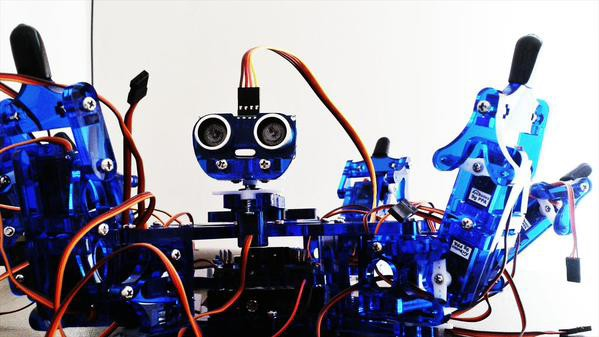

## WORKSHOP OUTLINE

Because hexapod robots are mechanically complex, expect that there are some Maths in this workshop. If you don’t like Math very well, you can skip the Maths parts and can still learn a lot anyway without getting overwhelmed :)

This workshop is split into seven sessions. Each session is split into two or three “mini-sessions”. Each “mini-session” is rated according to difficulty:_Very Easy_, _Easy_, _Medium__Easy_, _Medium_, _Medium Hard_, _Hard_. I hope I rated them correctly :)

Hopefully, this workshop is a good mix of theory, coding and mathematics.

Below is an outline of what you should expect in each session.

### SESSION0: WARMING UP

1. **How Awesome are Hexapods?** _(Introduction) \[Very Easy\]_
2. **Oh The Things We Do For Hexapod Robots** _(Outline)_ _\[Very Easy\]_
3. **Parts of Hexy** _\[Very Easy\]_

We have already discussed the advantages and disadvantages of hexapods. We have also discussed briefly what you can expect in this workshop. In this article I will be giving you an overview of what to expect in each session. In the next article, I will briefly discuss the parts of Hexy and how the parts interact with each other.

### SESSION1: A CLASSY HEXY

1. **A Hexapod Instance \[C_oding_\] _\[Medium Easy\]_**
2. **Implementation Details \[C_oding_\] _\[Medium Easy\]_**
3. **Controlling Hexy’s Joints \[C_oding\] \[Easy\]_**

We will be creating a _Hexapod class_ as well as a _Leg class_ and _Joint class_ in Python. We will be making a simple app that we will be interacting with to call an instance of the Hexapod object. Finally, we will control Hexy’s individual joints to make a series of awesome moves :)

### SESSION2: LEGS, LEGS, LEGS

1. **Leg Kinematics** \[_Mathematics_\]\[_Medium Hard_\]\[_Optional_\]
2. **More Leg Functions** \[_Coding_\]\[_Medium_\]
3. **Movement with Leg Functions** \[_Coding_\]\[_Easy_\]

We will be discussing a few things about the kinematics and inverse kinematics of Hexy’s legs. Kinematics is how you find the orientations of the legs if you know the angle each joint makes. Inverse kinematics is the opposite. We will be making a few functions for the _Leg Class_ like lifting Hexy’s foot given a height, replanting Hexy’s foot, swinging Hexy’s hips among many more. Finally, we will be using these new functions we have created to make Hexy do more awesome movements :).

### SESSION3: STABILITY OF HEXY

1. **The Many Kinds of Stability** _\[Theory\]\[Very Easy\]_
2. **Stable Hexy in Action** _\[Coding\]\[Easy\]_

If Hexy is not “statically-stable”, _madadapa si Hexy_ (Hexy will fall) and we don’t want that. Hexy should move in such a way that Hexy will maintain its balance. Balancing Hexy involves the relationship of the Hexy’s legs which are in contact with the ground and Hexy’s center of gravity. Armed with this theory, you can appreciate more how Hexy does moves like the _Michael Jackson’s Thriller_, _Saturday Night Fever Dance Step_, and _Typing_ without the risk of falling down.

### SESSION4: WALKING ALGORITHMS

1. **Common walking gaits** _\[Theory\]\[Easy\]_
2. **Walking Gaits in Action** _\[Coding\]\[Medium Easy\]_

Mostly we have programmed Hexy to move in place, now it’s time for Hexy to travel :). There are many different ways for Hexy to move from one place to another, the most common being the _Ripple,_ _Wave_, and _Tripod_ gaits. We will be programming Hexy to move forward/backward, side step to the left/right, as well as turn to the left/right.

### SESSION5: BODY KINEMATICS

1. **Body Kinematics** _\[Mathematics\]\[Medium Hard\]_\[_Optional_\]
2. **Body Kinematics: New Approach** _\[Mathematics\]\[Hard\]_\[_Optional_\]

Okay here is the hardest part, but also the most rewarding. Here we will be learning how to determine which angles each of of Hexy’s joints should have to control the orientation of Hexy’s body and also the location of Hexy’s geometric center.

### SESSION6: IT’S TIME TO SAY GOODBYE, IN STYLE!

1. **Putting It all Together: Hexy Dance Party** _\[Very Easy\]_
2. **Closing Remarks** _\[Very Easy\]_
