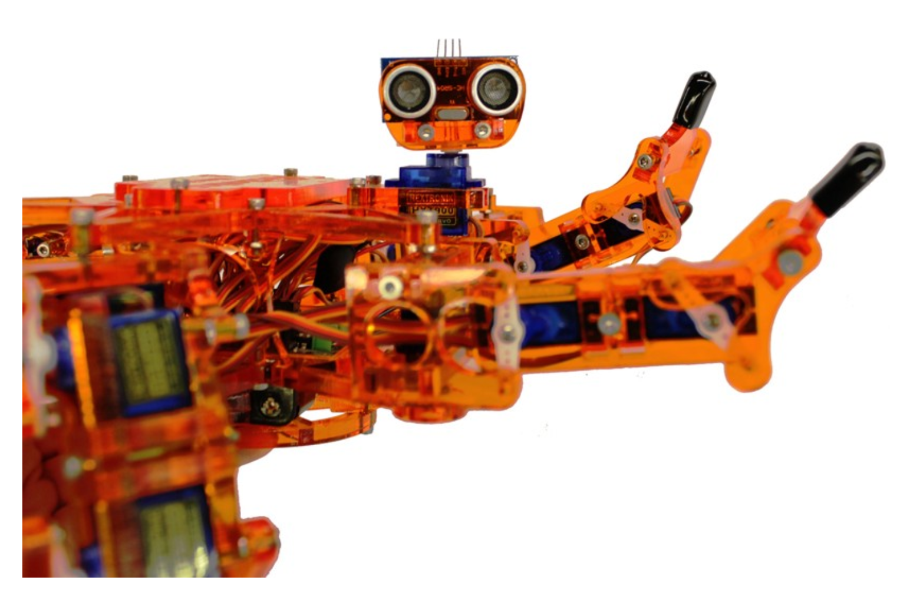
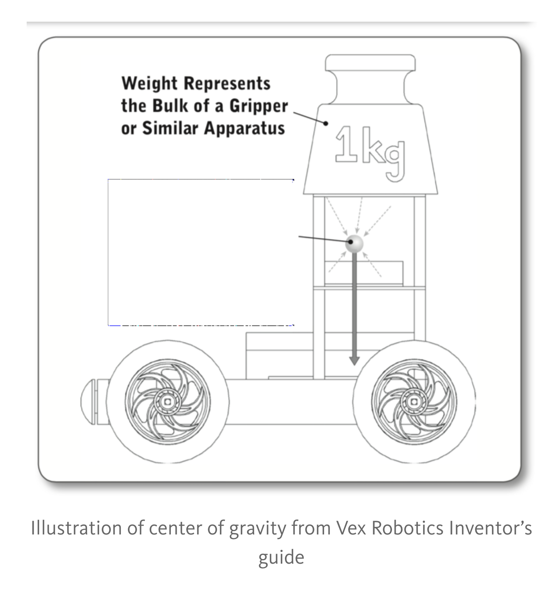
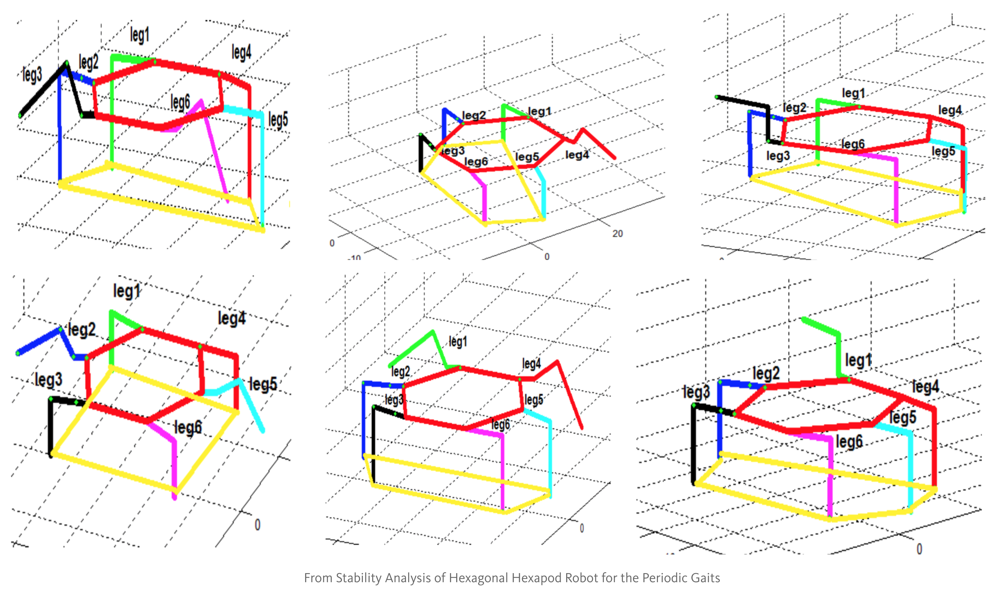
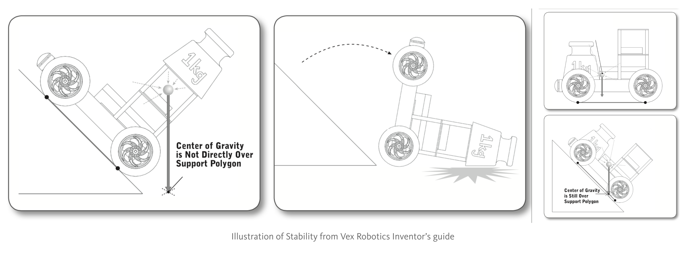
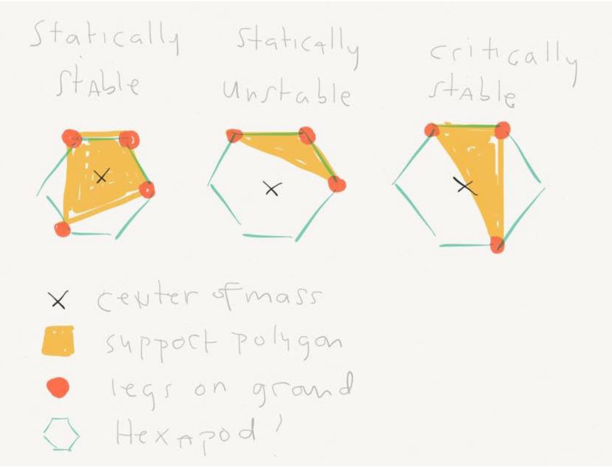
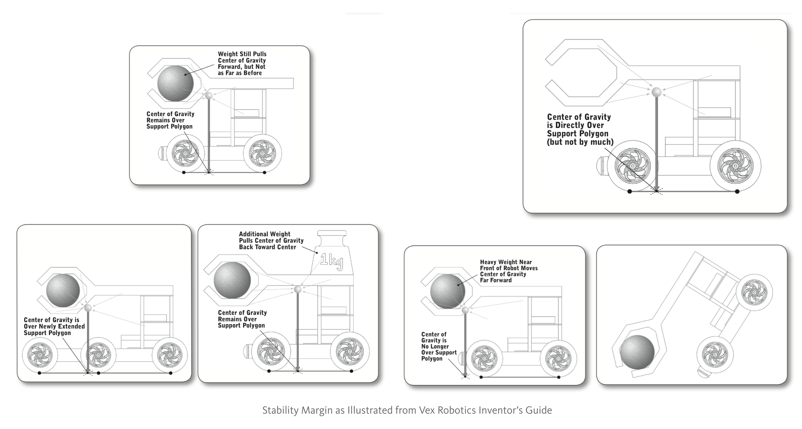

To maintain Hexy’s position in 3D space, Hexy has to have at least three points of support. This means three or more of Hexy’s legs need to be in contact with the ground. This is the first requirement to be _statically stable_.

## STATIC STABILITY

## 

_Statically stable_ means that Hexy will not fall down even if it’s staying still. Why do use a fancy term like _statically-stable_ instead of just plain good ol’_stable_? We do this to differentiate from _dynamical stability_ which is when something can maintain its balance when it is moving. People are not statically stable. To stand up continuously, we are using active control of our balance achieved through nerves and muscles.

 

It is important to remember that just because three of Hexy’s legs are planted in the ground doesn’t mean that it is already statically stable. There is another requirement. Aside from having three points of support, the projects of Hexy’s _center of gravity_should fall in the _support polygon_.

The _center of gravity_ of an object is the average location of the sum of Hexy’s weight.\* A quick way to find Hexy’s center of gravity is to push Hexy from the bottom with a finger. If Hexy does not turn to fall then that is Hexy’s center of gravity. Because Hexy is radially symmetrical and Hexy’s weight is relatively evenly distributed, we can safely assume that Hexy’s center of gravity is also at its geometric center.

 

A _support polygon_ on the other hand is the polygon determined by the support points of the object. For example, if all of Hexy’s legs are in the ground, the polygon created from connecting all of Hexy’s foot tips together is the support polygon.

Long discussion short, Hexy is **statically stable** \[_i.e. will maintain its position and orientation without doing anything_\] if the projection of Hexy’s **center of gravity** \[_i.e. average location of Hexy’s weight_\], falls into the support polygon \[_i.e. the polygon created by joining Hexy’s points of contact with the ground_\].

## STABILITY STATES

For the purpose of discussion we can define Hexy’s _stability state_ (or _state_ in short) as Hexy’s current position and orientation of each of Hexy’s parts (I.E legs and body). We can classify Hexy’s stability state into three major categories: _stable_, _unstable_, and _critically stable_. Being statically unstable is just the opposite of statically stable, which means that if Hexy won’t be able to maintain its stability state without moving. Hexy is critically stable Hexy’s center of gravity falls on one side of the support polygon. This means if Hexy just tips slightly just a little bit or makes a slight movement in a certain direction Hexy will become statically unstable and fall.

We can also measure Hexy’s “_statically-stable-ness_” or how unlikely Hexy will lose its balance. There is a term called _static_ _stability margin_ which is defined as the shortest distance between the projection of Hexy’s center of gravity and the boundary of the support polygon. If the stability margin is small, then Hexy is more likely to lose its balance if Hexy tips towards this boundary. This means that Hexy is most stable when Hexy’s center of gravity lies at the geometric center of its support polygon.

 

Let’s keep the concept of stability in mind when designing movement algorithms for Hexy. In the next discussion, we will be making movement algorithms that will make Hexy perform the Michael Jackson’s _thriller dance step_, the s_aturday night fever dance step_ as well as other moves like making a_typing gesture_. I hope you appreciate what role stability plays in movements like this. What other kinds of dance moves can you think for Hexy? Did you consider how stable Hexy will be while performing these moves?

#### Key Terms:

- Static stability, center of gravity, support polygon
- Stability margin, critically stable

#### REFERENCES:

- [Basic Walking Simulations and Gravitational Stability Analysis for a Hexapod Robot using Matlab](https://scholar.google.com/citations?view_op=view_citation&hl=en&user=oM5wRAcAAAAJ&citation_for_view=oM5wRAcAAAAJ:dhFuZR0502QC) S Mănoiu-Olaru, M Niţulescu
- Stability Analysis of Hexagonal Hexapod Robot for the Periodic Gaits Dr. Firas A. Raheem, Hind Z. Khaleel
