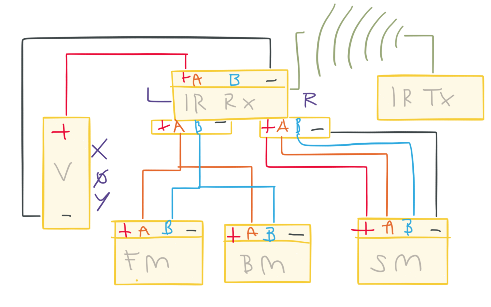
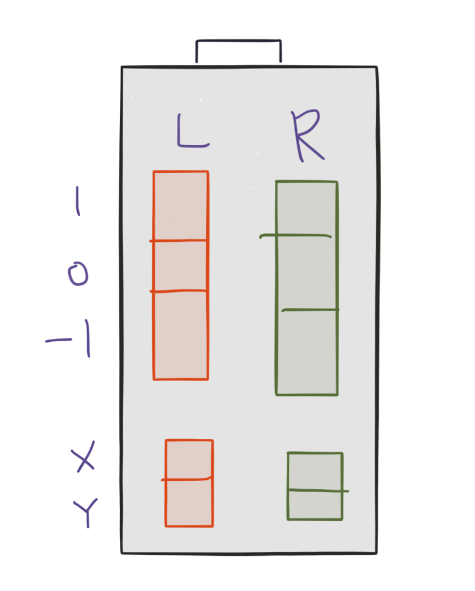
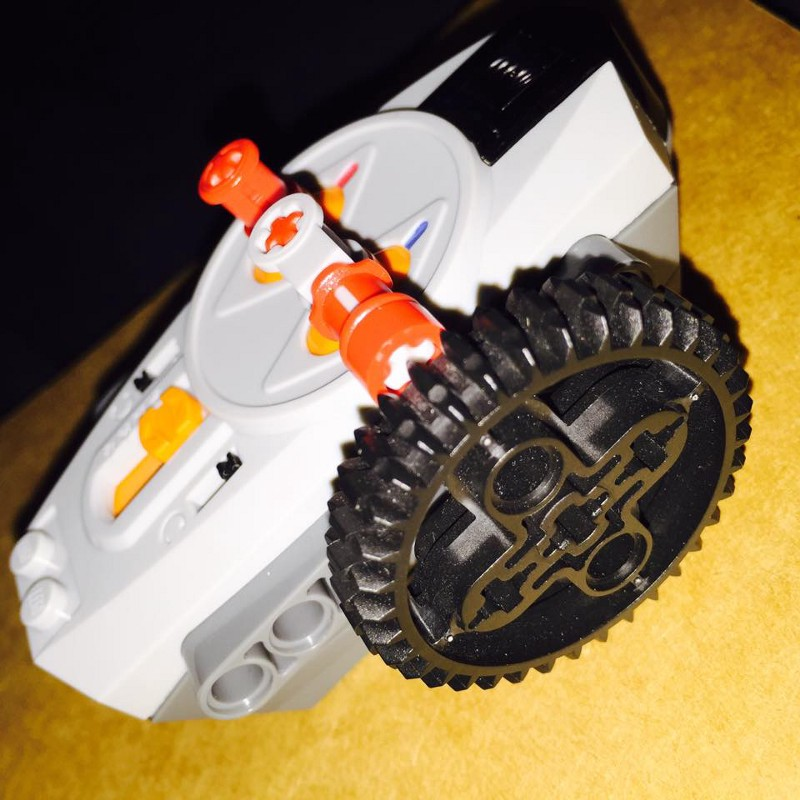
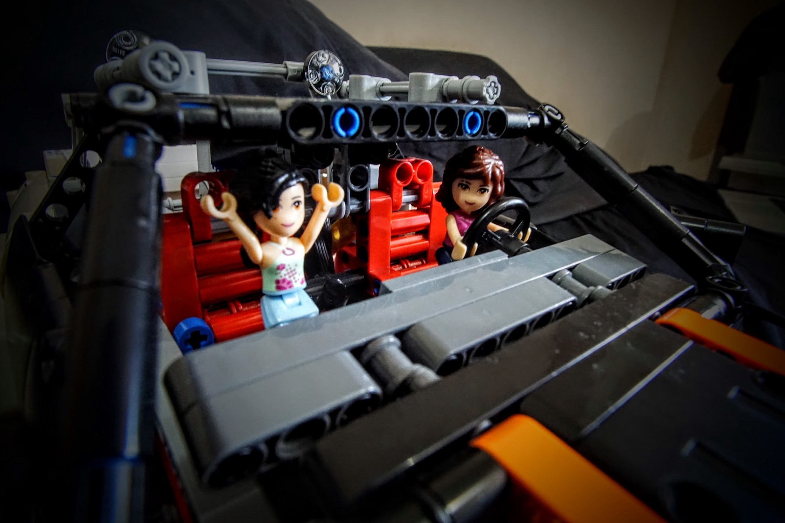

Fig 1: Electrical Abstraction

 

* * *

### The Battery Block \[V\]

The battery block \[V\] supplies the power to the whole circuit. It is connected to the the infrared receiver block \[IRRx\]. The battery block includes additional circuitry that allows the user to choose among three states \[x, o, y\] — the ‘powered off’ state \[o\] and two ‘powered on’ \[x, y\] states. The two ‘powered on’ states specifies which rotation of the motor assumes the ‘forward’ state. These states are probably implemented via some sort of [h-bridge](http://www.modularcircuits.com/blog/articles/h-bridge-secrets/h-bridges-the-basics/). I assume that this is a typical power supply which means only two of the four wires from the battery block to the receiver block are connected \[Vs, GND\].

* * *

#### The IR Remote block \[IRTx\]

The IR receiver block receives instructions wirelessly from the remote block via infrared communication protocol \[[which the official lego group generously provided](http://www.philohome.com/pf/LEGO_Power_Functions_RC_v120.pdf)\].

**Fig 2 IR Remote Abstraction**

You can use the two independent levers of the remote block to control the two independent outlets of the receiver block. The right lever controls the blue outlet and the left lever controls the red outlet. They do not interfere with each other and can be controlled simultaneously. Each of the two levers can have three position, and seven transitions. The positions are up, neutral and down {1, 0, -1}. The transitions are up to neutral, neutral to up, down to neutral, neutral to down, up to up, down to down, neutral to neutral {(1, 0), (0,1), (0, -1), (-1, 0), (1, 1), (-1, 1), (0, 0)}. Notice that you can’t go directly from up to down and vice versa.

There are also two pole reversers below each of the levers. These determine which direction the motor connected to the corresponding outlet rotate. Each receiver block can control at most only two outlets independently, but each remote block can control up to four receiver blocks. Use the channel selectors for this.

* * *

#### The Three Motor Blocks \[FM, BM, SM\]

Attached to the left block as indicated in the diagram are two dc motors: the front motor \[FM\], and the back motor \[BM\]. For each motor, only two of the four wires are essential to spin the motors in either direction (in any possible speed), so like on the battery block, only two are connected. Since both motors are connected to the same outlet, they are given the same commands and rotate the same way.

On the right block, a servo motor \[SM\] is connected . The servo motor needs at least three inputs - voltages supply, ground reference and control signal. [In this case, two wires are responsible for delivering the control signal, so all the wires are used](http://www.philohome.com/pfservo/pfservo.htm).

* * *

[For more detailed technical information of the the power functions described above, you can visit Philo’s site](http://www.philohome.com/tech.htm).

[Chapter 13 of Sariel’s book also provides a good discussion of the power functions.](http://www.nostarch.com/technicbuilder)

