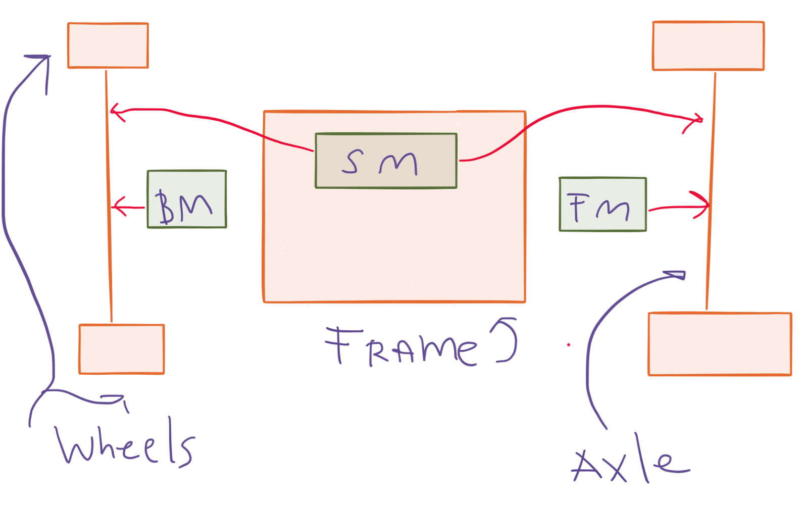

###### Figure 1. BM (back motor), FM (front motor), SM (steering servo motor)

* * *

The axles in the front and the back are powered by two separate motors even though you can’t control the motors independently.

* * *

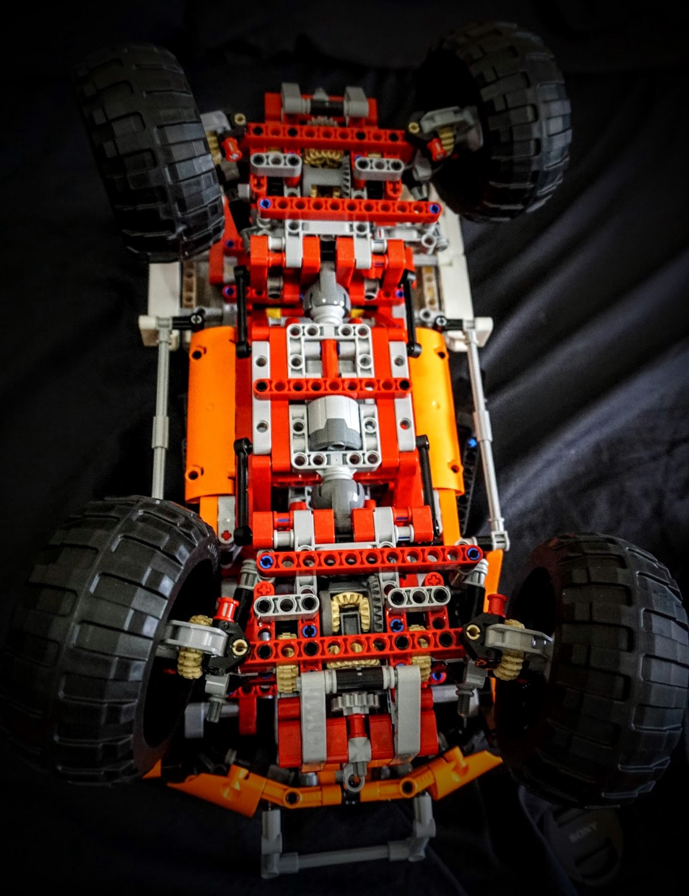

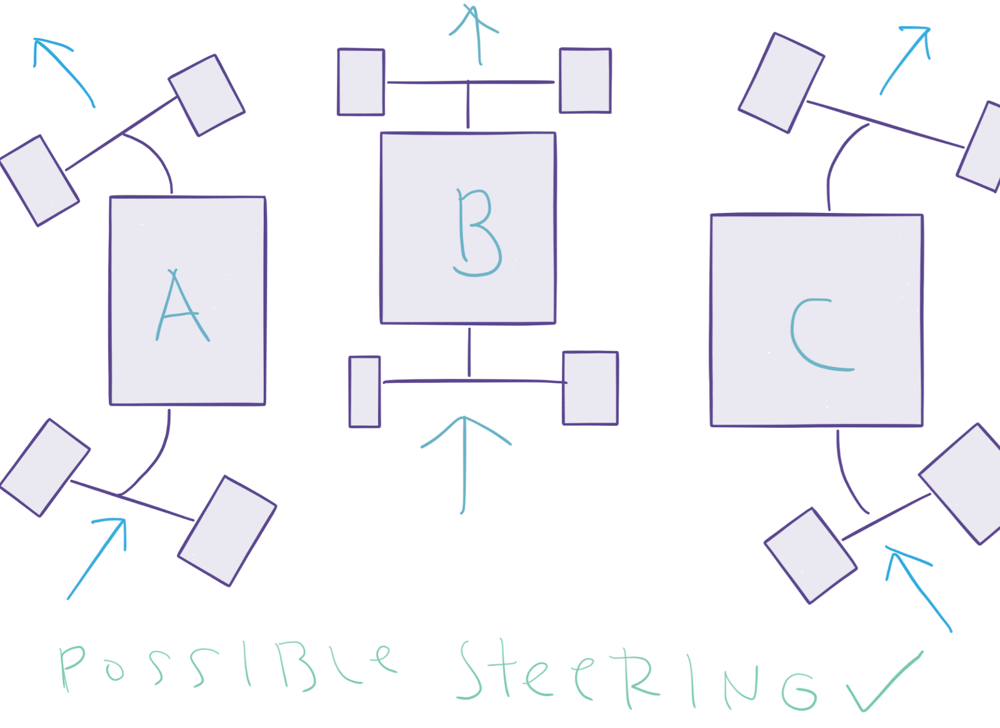

###### Figure 2. Possible steering configurations

* * *

Both the front and the back axles are steered. The steering is performed by only one servo. The possible steering configurations are limited to the cases illustrated in the figure above (figure 2). Impossible steering configurations are illustrated in the figure below (figure 3).

* * *

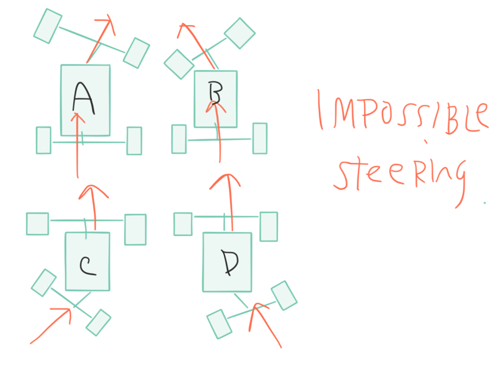

###### Figure 3. Impossible steering configurations

* * *

 

#### Steering Geometry

The steering geometry is very easy to understand in its simplest form. A pinion is connected to the shaft of the servo motor which is meshed to a rack. The rack is parallel to the wheel’s axle. This configuration forms a four-bar linkage. The mechanism is illustrated in the figures below.

* * *

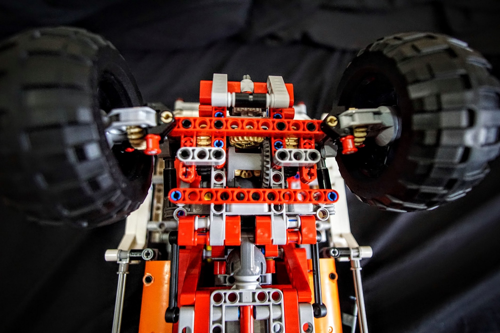

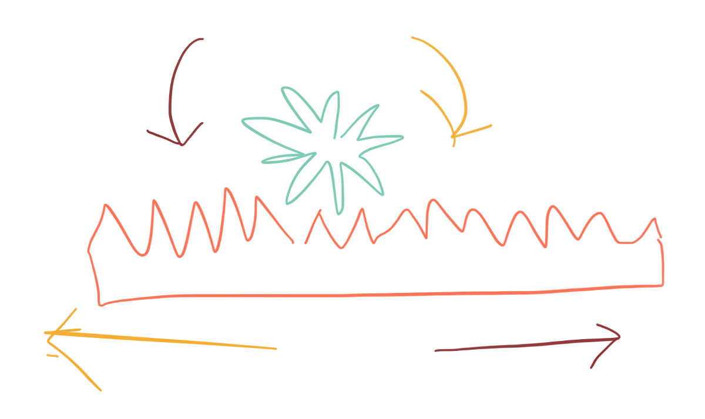

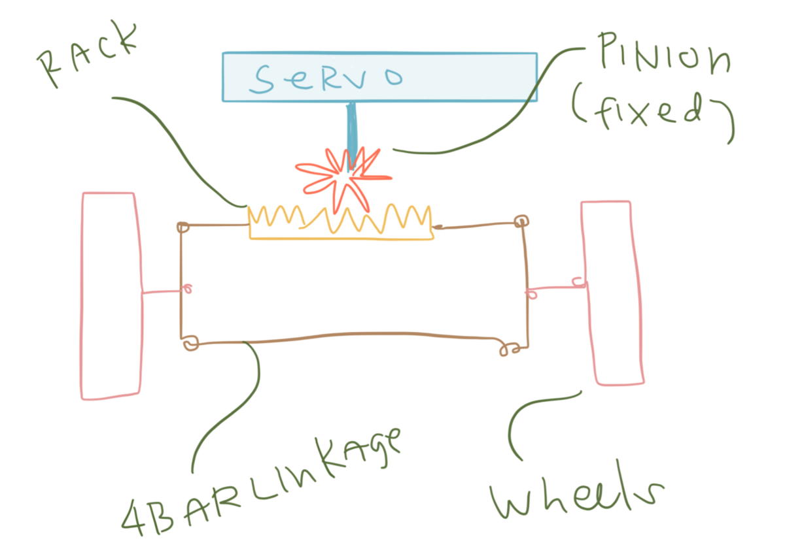

* * *

Rack and pinion (left), steering mechanism (right). Though the right figure shows the top view of the four-bar linkage and wheels ,the rack and pinion mechanisms is shown from the front to illustrate the mechanism.

 

* * *

 

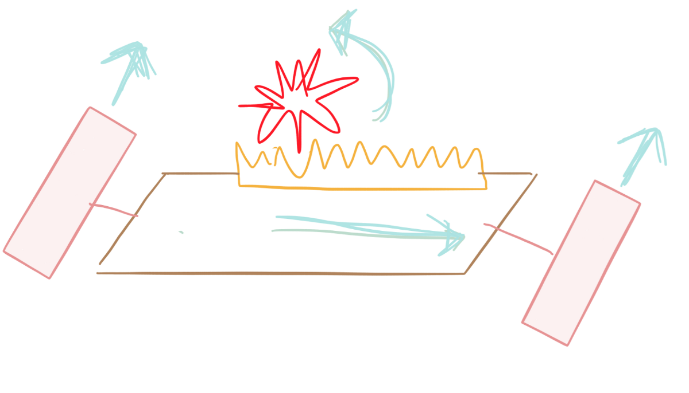

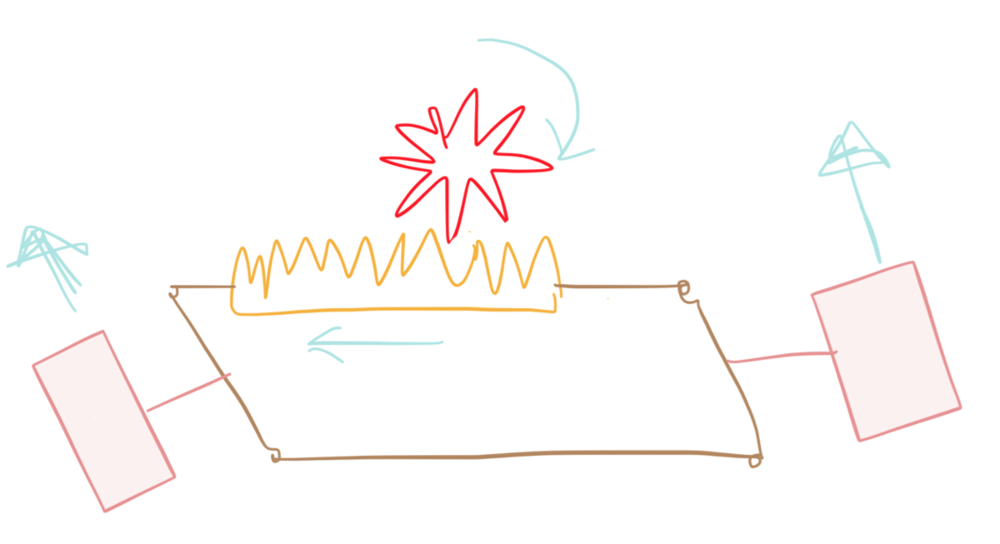

* * *

This illustrates the mechanism of the rear axle in it’s simplest form. The two figures above show the top view of the four-bar linkage and wheels ,the rack and pinion mechanisms is shown from the front to illustrate the mechanism.

 

* * *

 

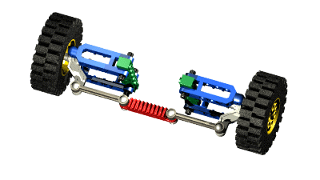

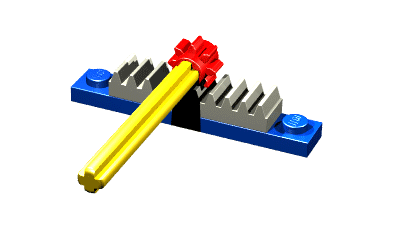

###### Rack and pinion animation and Ackerman Steering geometry as taken from Blakbird’s Technicopedia page.

* * *

This kind of steering will skid because it has roughly the same angles, the centers of curvature of the wheels are different.\*\*

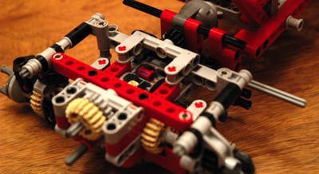

###### Picture from Blackbird’s review which shows that the pin attachment is one stud in board

\*\*It has been pointed out by [Blakbird in his review that there is a slight Ackerman steering](http://www.eurobricks.com/forum/index.php?showtopic=71350) in this model because the pin attachment is one stud in board (which means that the angle is not exactly the same).

* * *

An Ackermann steering geometry would reduce the skidding which will minimize the friction experienced by the tires when turning. Minimizing the friction experienced by the tires means minimizing the tires’ wear-and-tear.

* * *

Two videos below provide good explanations of the Ackerman Steering geometry by Ujjwal Rane and Engineering Explained.

* * *

\[youtube https://www.youtube.com/watch?v=dKlT6OpkjM4&w=560&h=315\]

* * *

\[youtube https://www.youtube.com/watch?v=oYMMdjbmQXc&w=560&h=315\]

* * *

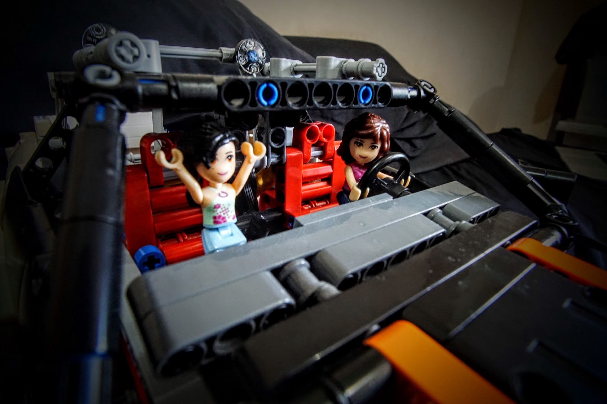
