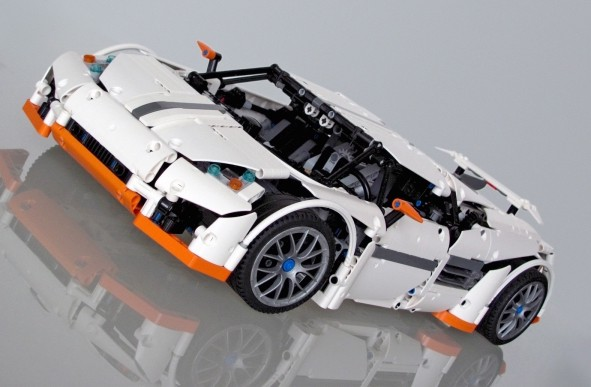
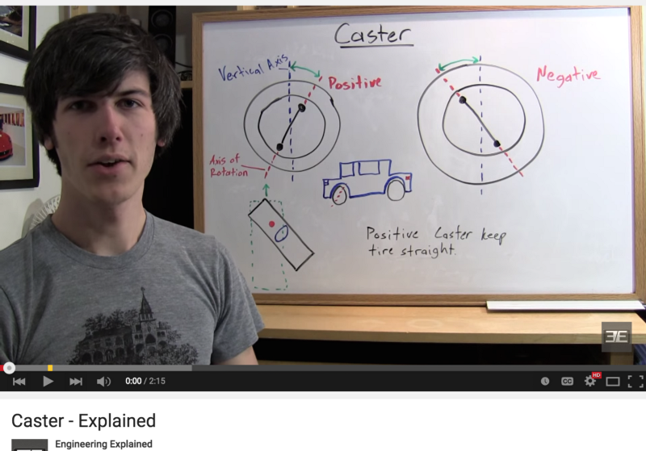

A suspension is a set of components that connect the frame of the vehicle to the wheels. The function of a suspension is to keep the wheels in constant contact to the ground. Maintaining contact ensures stability. The suspension should also usually isolate the frame of the vehicle from vibrations and bumps generated by the ground. ([among many other functions](http://auto.howstuffworks.com/car-suspension.htm))

* * *

The suspension of this vehicle is more commonly known as pendular (or solid axle/beam axle) suspension. This is the simplest and most robust kind of suspension. Being a dependent suspension, the movement of one wheel affects the other wheel on the same axle. [This is realistic as this suspension is usually used for off-road vehicles. It is used because it is easier for all wheels to keep contact to the ground when traversing large obstacles (axle articulation)](http://en.wikipedia.org/wiki/Ramp_travel_index).

The downside of this kind of suspension is that it is less stable (as the whole vehicle will tilt). This is bad for the driver/passenger’s comfort.

To compensate, there are springs (with a dampening effect) to increase its stability and to absorb shock. This is also realistic. There is a large gap between the suspension and the chassis for going over obstacles in the environment.

* * *

* * *

Opposed to this kind of suspension which has high articulation (ability to flex thus more distance traveled over a ramp with all four wheels on the ground) but reduced driver comfort, is an independent suspension. An independed suspension has reduced articulation but increased driver comfort (less vibrations and stability). Independent suspension allow each wheel on the same axle to move vertically (i.e. reacting to a bump in the road) independently of each other.

Even though dependent suspensions are better for obstacles, [it is said that most modern off-road vehicles use an independent suspension on the front axle (will a solid axle still in the rear) because of the benefits listed above.](http://forums.lr4x4.com/index.php?showtopic=85790)

* * *

###### Explanation of MacPherson’s strut and Double wishbone suspension by Engineering Explained

 

* * *

 

In case you are interested in modifying the Crawler, two common independent suspension that could’ve been used for the front axle (which are also commonly used for Lego vehicle design of enthusiasts) are the MacPherson’s strut and the double wishbone suspension. ([here](https://www.youtube.com/watch?v=1fvJMxErfms) and [here](https://www.youtube.com/watch?v=DsEmK1M87VQ) for detailed explanations)

* * *

## WHEEL ALIGNMENTS

* * *

[This model has negative caster and zero camber in the front wheels. This has been pointed out to be not very realistic.](http://www.eurobricks.com/forum/index.php?showtopic=71350&st=0) First, I will define what caster, camber and kingpin angles are and how it affects the vehicle. Video links (made by other people) will follow which provide better explanations than mine.

* * *

* * *

(Wheel alignments are considered by many lego enthusiasts when designing their own models such as [SHEEPO’S MUSTANG SHELBY](http://www.sheepo.es/2013/10/ford-mustang-shelby-gt500-14.html), and [NATHANIEL’S PREDATOR SUPERCAR](http://nkubate.com/index.php?option=com_k2&view=item&id=67:predator-supercar&Itemid=566) )

* * *

* * *

**CASTER ANGLE**

- A positive caster angle (trailing caster) makes the car easier to drive. It improves its directional stability (reducing its tendency to wander), and also steering wheel returnability
- Excessive caster will make steering heavier and less responsive but in racing it is sometimes used to improve cornering.
- A seven degree positive caster is usually used.

 

**CAMBER ANGLE**

- Most vehicles have slight positive camber with steering axis inclination
- Racing/Offroad vehicles have zero or negative camber for wider stance and greater stability at cornering.

 

**KINGPIN INCLINATION OR STEERING AXIS INCLINATION**

- Steering axis inclination creates a much smaller scrub radius which makes tire rotate more easily and less tire wear. This also reduces steering effort at low speeds and turning. Wheels go straight when steering is released.

 

* * *

### Explanations by Engineering Explained

\[1:37\] CAMBER — [youtu.be/jSFmUmVWBp0](http://youtu.be/jSFmUmVWBp0?t=30s)

\[2:33\] STEERING AXIS INCLINATION — [youtu.be/IUcZ63unEyU](http://youtu.be/IUcZ63unEyU)

\[2:15\] CASTER — [youtu.be/Gh7gWJAvOvs](http://youtu.be/Gh7gWJAvOvs)

* * *

### Explanations by LPEPower’s Nicjasno

#### What is wrong with the Unimog Steering?

 \[youtube https://www.youtube.com/watch?v=QT0YCePNB8o?list=PLDD4E280828C6A22D&w=900&h=500\]

Kingpin Inclination — [https://www.youtube.com/watch?v=Rvzw5rX50\_o](https://www.youtube.com/watch?v=Rvzw5rX50_o)

Caster — [https://www.youtube.com/watch?v=aK-zgwc9HyE](https://www.youtube.com/watch?v=aK-zgwc9HyE)

* * *

