## Differentials

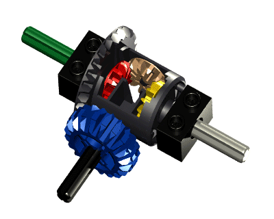

The problem with a vehicle with two drive wheels is that when it turns a corner the drive wheels must have different speeds to maintain traction. The automotive differential is designed to drive a pair of wheels while allowing them to rotate at different speeds. There are many variants of a differential, the simplest being the open differential. The Lego 4x4 crawler has this. It has two differentials, one in each axle.

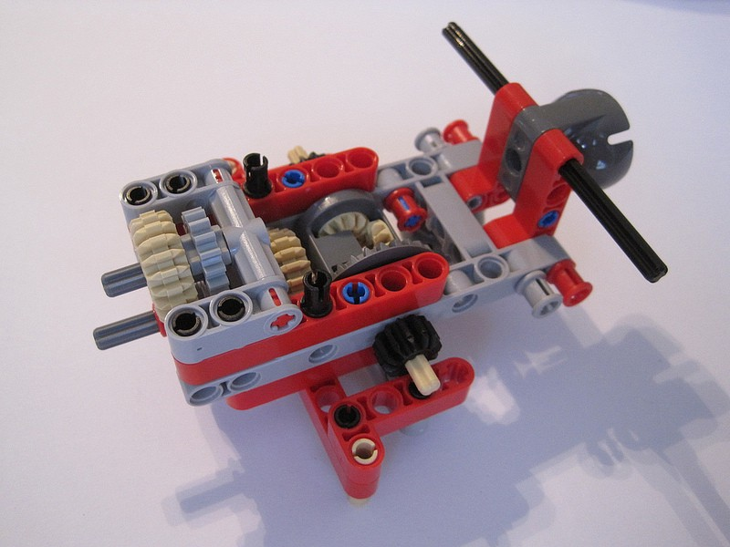

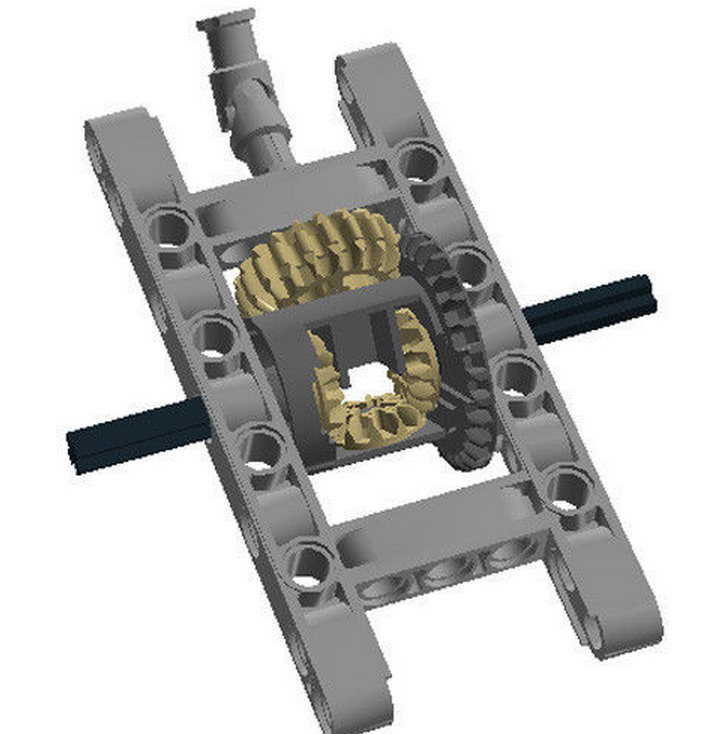

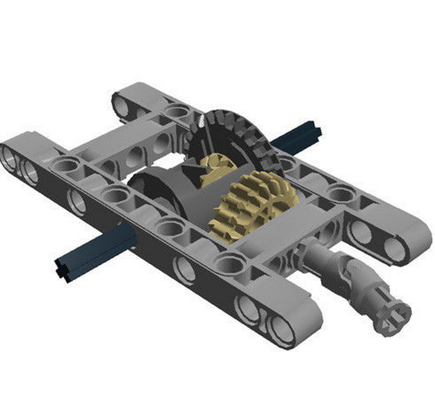

Watch the following video to understand how a differential works. This video was made in 1937 but it is still one of the best explanations I can find.

\[youtube https://www.youtube.com/watch?v=F40ZBDAG8-o&w=1260&h=945\]

The engine’s power follows the path of least resistance. This means that in cases where one wheel has less traction (such as on thin ice), the engines power will go to the wheel with least traction. The open differential always applies the same amount of torque to each wheel. This means that even with more torque, there needs to be enough traction to transmit that torque to the ground. Without enough traction, the wheels will just slip and just spin faster. This can also happen when you are driving off road, when one of the back tires goes off ground, they will just spin helplessly in the air which happens with the 4x4 crawler sometimes. There are many proposed solutions for this explained all over the web :).

Here are two more videos about differentials which you might find useful.

**\[5:17\]** [**How a differential works? By Learn Engineering**](https://www.youtube.com/watch?v=SOgoejxzF8c)

**\[4:43\]** [**How a differential works and types of differentials by Allegoro Racing for Toyota 2007**](https://www.youtube.com/watch?v=gIGvhvOhLHU)

The problem with the lego differential pieces is that they are not that strong and are thus torque sensitive. If you drive the vehicle such that it requires more torque than it can handle, the differential might eventually get really damaged.

* * *

## Gear Drives

The purposes of gear drives is to tranform the motor’s properties to suit our purpose; namely control the speed, rotation direction and torque. Given that the power of the motor is fixed and that mechanical power is essentially the product of speed (how fast) and torque (how strong the turning force is), we can trade speed for torque or torque for speed using gear drives. In this case the gear drive is a torque multiplier of about 7:1 excluding what’s inside the motor case.

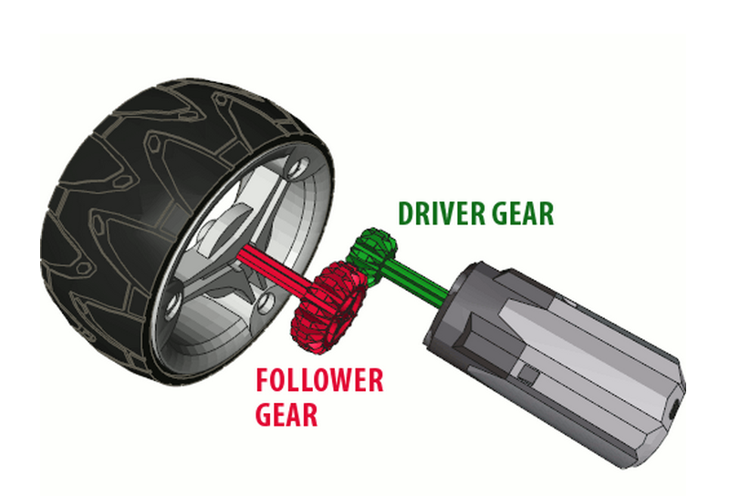

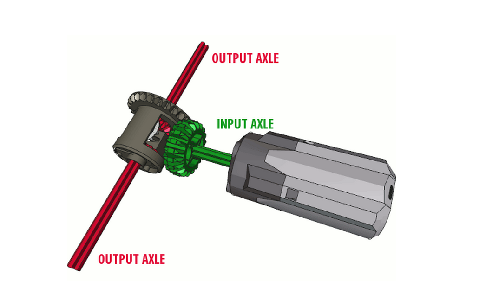

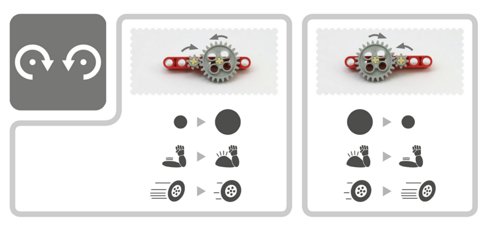

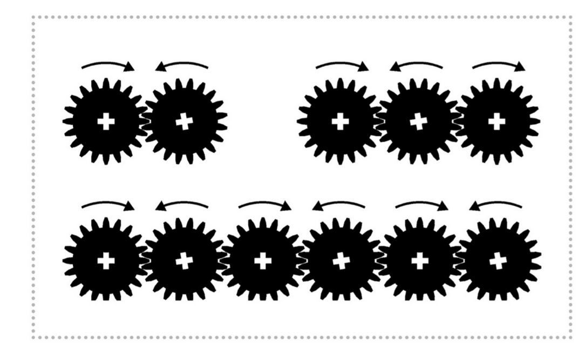

* * *

**_As Blakbird said in his review:_**

**_You can count up the gear reduction. One stage is diff to 20 tooth gear, 28:20. There are then 3 sets of 12:20 bevel gears (one set in the wheel hub, one shown here by the diff, one in the front of the picture going up to the motor), giving a total of 7:1. Plus, of course, whatever is inside the motor._**

* * *

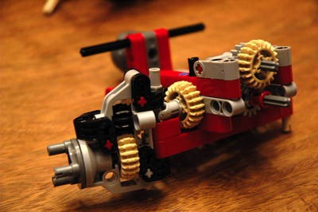

From Blakbird

If you want to learn more about gears and gear trains you can check out my lecture slides or Sariel’s article on gears.

1. [**Mithi’s lecture on gears and basic power transmission**](https://drive.google.com/open?id=0Bza5l9R3WouWUTRuSG9FUW4yM2c)
2. [**Sariel’s guide on Lego gears**](http://sariel.pl/2009/09/gears-tutorial/)

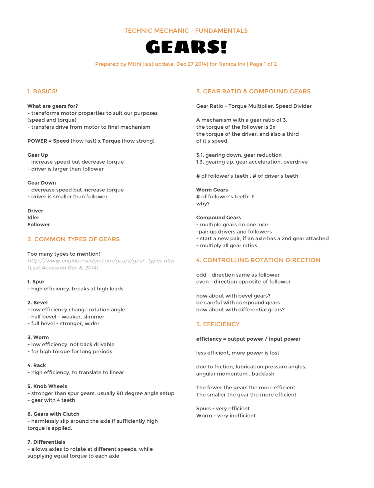

* * *

## Weight Distribution + Ground Clearance

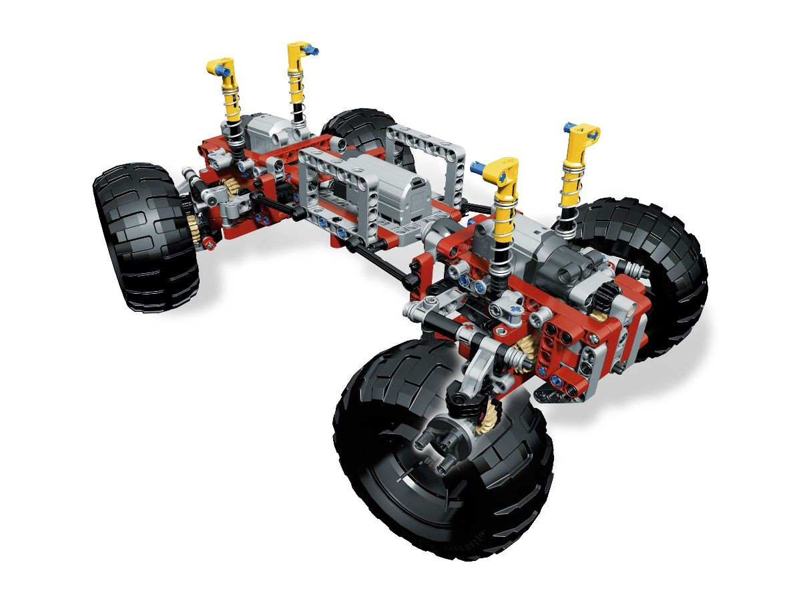

Because the vehicle’s internal framework is roughly symmetrical, the weight distribution of this vehicle is roughly 50:50. This means that around half of the vehicles weight rests on the front axle and the other half on the rear axle. This is ideal to off-road cars like this one for stability but of course it’s not always the case for all types of vehicles. If the vehicle is more front heavy it will have better steering traction, while if it is more rear heavy it will have better acceleration.

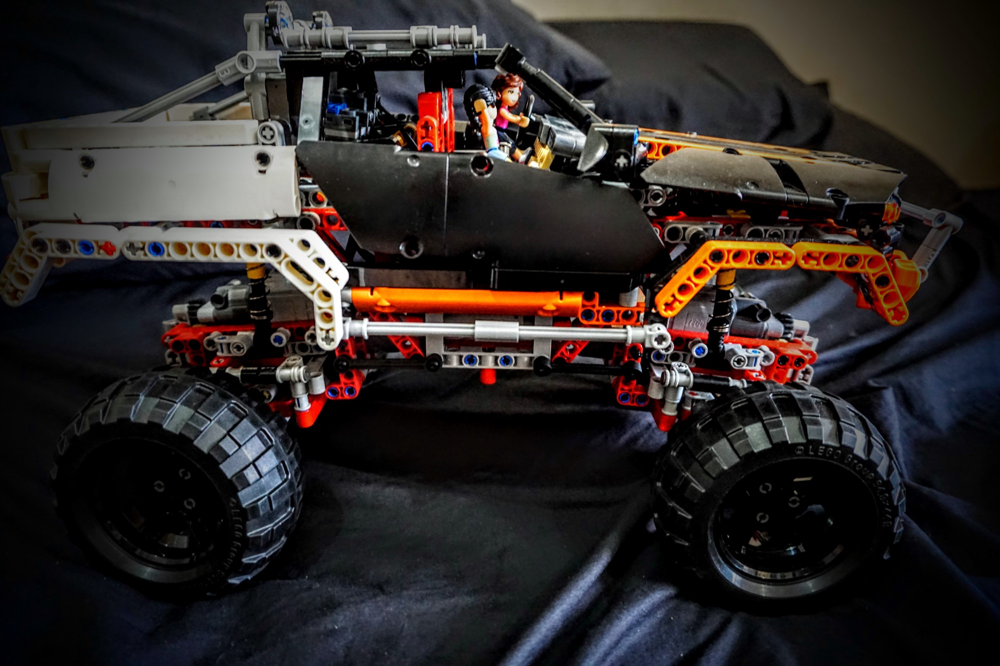

The center of gravity is the central point of an object’s weight distribution. In this case, because of the roughly 50:50 distribution, it is located on almost the actual center of the crawler. It determines the crawler’s likelihood of falling over as well. The higher the center of gravity, the greater this likelihood. This model has a relatively high center of gravity as a trade-off to have good ground clearance.

Ground clearance is the distance between the underside of the chassis and the flat level surface it is resting upon. The higher the ground clearance the higher the height of obstacles it can drive over. One thing you can notice about this crawler is that it has high ground clearance at the center but it has low ground clearance on the front and rear.

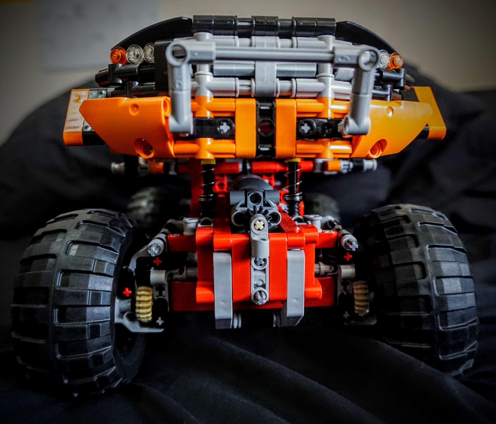

* * *

## Tires

Tires with good traction don’t slip over surfaces as easily and depends primarily on the hardness and shape of the tires. Tires with a flat profile and small threads are better in flat smooth surfaces while tires with a round profile have better contact with irregular surfaces. Also, the wider the tires the more contact it can have with a surface. Tires of the 4x4 crawler seem apt for the job but I wish that they’re slightly bigger though :).

* * *

### Summary

This series of articles outlines the things I have learned about vehicle design in the context of the Lego Technic Set 4x4 Crawler \[9398\]. Firstly, I talked about how the power function modules work with each other. I then discussed how steering is achieved through a rack and pinion connected to a four-bar linkage. I also talked about wheel alignments and suspensions and and how it compared to real life vehicles. Lastly, I gathered some thoughts about miscellaneous aspects of the crawler — differentials, tires, gear drives, weight distribution, ground clearance.

I hope you enjoy learning about vehicle design in the context of this vehicle as much as I enjoyed writing these articles. Please feel free to tell me what you think or correct any technical errors I might have made in regards to vehicle design. Thank you!

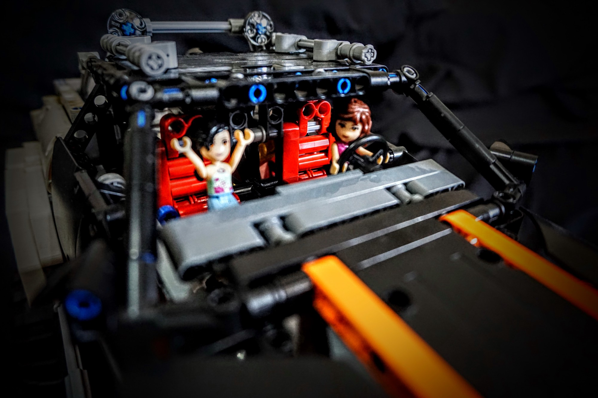
